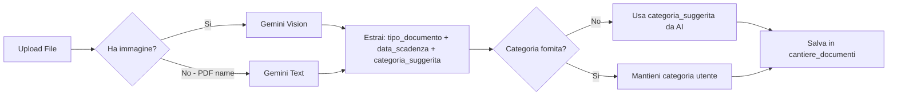

# Piano: Gestione Documentale Cantiere + Fix Preventivazione

## Contesto

Il modulo "Preventivazione Intelligence & RAG" è stato implementato a livello di codice applicativo, ma **manca la migrazione SQL** che crea le tabelle `prezziario_ufficiale_2025`, `storico_costi_lavorazioni` e le colonne AI su `computo_voci`. Senza questa migrazione, il RAG non ha dati da interrogare.

Il nuovo modulo "Gestione Documentale Cantiere" trasforma la gestione documentale da semplice contenitore a sistema di controllo scadenze proattivo, vitale per sicurezza sul lavoro (POS, PSC) e manutenzione attrezzature.

---

## Architettura Complessiva

```mermaid
flowchart TB
    subgraph UI [Frontend - Next.js Pages]
        A1[/cantieri/id/archivio]
        A2[/cantieri/id/computo - OCR foto]
    end

    subgraph API [API Routes]
        B1[/api/preventivo/ocr]
        B2[/api/cron/scadenze]
        B3[/api/calendar]
    end

    subgraph AI [Gemini Intelligence]
        C1[parseDocumentoCantiere - Smart Expiry]
        C2[parseComputoFoto - OCR Tabellare]
        C3[matchSemanticoPrezziario - RAG esistente]
    end

    subgraph DB [Supabase]
        D1[cantiere_documenti]
        D2[prezziario_ufficiale_2025]
        D3[storico_costi_lavorazioni]
        D4[computo_voci - colonne AI]
    end

    subgraph EXT [Integrazioni Esterne]
        E1[WhatsApp - Notifiche scadenze]
        E2[Apple Calendar - File .ics]
        E3[Supabase Storage - Bucket documenti]
    end

    A1 -->|Upload doc| C1
    C1 -->|Categoria + Scadenza| D1
    D1 -->|Storage| E3
    B2 -->|Cron notturno| D1
    B2 -->|Scadenze < 30gg| E1
    E1 -->|Link .ics| B3
    B3 -->|Download| E2

    A2 -->|Foto computo| B1
    B1 -->|Analisi| C2
    C2 -->|Righe estratte| C3
    C3 -->|Range prezzi| D4
```

---

## STEP 0: Fix Migrazione Preventivazione (Critico)

### File: `supabase/migrations/20260220_preventivazione_intelligence.sql`

Crea le tabelle mancanti che il codice già referenzia:

**Tabella `prezziario_ufficiale_2025`:**
- `id` UUID PK
- `codice_tariffa` TEXT NOT NULL
- `descrizione` TEXT NOT NULL
- `unita_misura` TEXT
- `prezzo_unitario` NUMERIC NOT NULL
- `capitolo` TEXT (per raggruppamento)
- `created_at` TIMESTAMPTZ

Indici: GIN su `descrizione` per full-text search, BTREE su `codice_tariffa`.

**Tabella `storico_costi_lavorazioni`:**
- `id` UUID PK
- `descrizione_lavorazione` TEXT NOT NULL
- `unita_misura` TEXT
- `costo_reale_unitario` NUMERIC
- `cantiere_id` UUID FK → cantieri
- `data_rilevazione` DATE
- `fonte` TEXT (es. computo cantiere X)

Indice GIN su `descrizione_lavorazione`.

**ALTER TABLE `computo_voci`** - aggiunta colonne AI:
- `ai_prezzo_stimato` NUMERIC
- `ai_prezzo_min` NUMERIC
- `ai_prezzo_max` NUMERIC
- `ai_confidence_score` NUMERIC
- `ai_match_id` UUID (FK → prezziario_ufficiale_2025)
- `stato_validazione` TEXT DEFAULT 'da_validare' CHECK IN ('da_validare', 'confermato', 'modificato')

---

## FASE 1: Database - Tabella `cantiere_documenti`

### File: `supabase/migrations/20260220_cantiere_documenti.sql`

```
cantiere_documenti
├── id: UUID PK
├── cantiere_id: UUID FK → cantieri
├── nome_file: TEXT NOT NULL
├── url_storage: TEXT NOT NULL
├── categoria: TEXT CHECK IN - Sicurezza_POS_PSC, Manutenzione_Mezzi, Personale, DDT_Fatture, Foto, Altro
├── data_scadenza: DATE nullable
├── stato_scadenza: TEXT GENERATED - Valido, In_Scadenza, Scaduto
├── note: TEXT
├── ai_dati_estratti: JSONB
├── scadenza_notificata: BOOLEAN DEFAULT false
├── created_at: TIMESTAMPTZ
└── updated_at: TIMESTAMPTZ
```

**`stato_scadenza`** è una colonna generata:
- `NULL` se `data_scadenza IS NULL` → 'Valido'
- `data_scadenza < NOW()` → 'Scaduto'
- `data_scadenza < NOW() + 30 days` → 'In_Scadenza'
- Altrimenti → 'Valido'

**Storage bucket**: `documenti_cantiere` con struttura `/{cantiere_id}/{categoria}/{nome_file}`

**RLS**: Accesso solo per utenti autenticati.

---

## FASE 2: AI Intelligence - Smart Expiry

### File: `utils/ai/gemini.ts` - Nuova funzione `parseDocumentoCantiere()`



**Interfaccia risposta:**
```typescript
interface DocumentoCantiereParsed {
  tipo_documento: string;        // es. POS, Libretto Gru, Corso Sicurezza
  data_scadenza: string | null;  // YYYY-MM-DD
  categoria_suggerita: string;   // Sicurezza_POS_PSC, Manutenzione_Mezzi, etc.
  confidence: number;            // 0.0-1.0
  note_estratte: string;         // Info aggiuntive trovate
}
```

### File: `utils/data-fetcher.ts` - Nuove funzioni CRUD

- `getDocumentiCantiere(cantiere_id)` - Lista con filtri categoria/stato
- `salvaDocumentoCantiere(params)` - Insert con upload storage
- `aggiornaDocumentoCantiere(id, params)` - Update (rinnovo)
- `eliminaDocumentoCantiere(id)` - Delete + rimuovi da storage
- `getDocumentiCantiereInScadenza(giorni)` - Per il cron job

---

## FASE 3: UI - File Browser `/cantieri/[id]/archivio`

### File: `app/cantieri/[id]/archivio/page.tsx`

Layout della pagina:

```
┌─────────────────────────────────────────────────────┐
│ ← Torna alla Dashboard    ARCHIVIO DOCUMENTI        │
│                            Cantiere: Via Roma 15     │
├─────────────────────────────────────────────────────┤
│ [Upload Documento]  [Filtro: Tutte ▼]  [🔍 Cerca]  │
├─────────────────────────────────────────────────────┤
│ 📊 Statistiche: 12 doc | 2 In Scadenza | 1 Scaduto │
├─────────────────────────────────────────────────────┤
│ Nome File          │ Categoria    │ Scadenza │ Stato│
│────────────────────┼──────────────┼──────────┼──────│
│ POS_cantiere.pdf   │ 🔒 Sicurezza │ 15/03/26 │ 🟢  │
│ Libretto_gru.pdf   │ 🔧 Mezzi     │ 28/02/26 │ 🟠  │
│ Corso_primo_socc.  │ 👷 Personale │ 10/02/26 │ 🔴  │
│ DDT_fornitore.jpg  │ 📄 DDT       │    -     │ ✅  │
└─────────────────────────────────────────────────────┘
```

**Componenti chiave:**
- Filtro per categoria (tabs o dropdown)
- Ricerca testuale su nome file e note
- Badge colorati: 🟢 Verde (Ok), 🟠 Arancione (< 30gg), 🔴 Rosso (Scaduto)
- Pulsante "Rinnova" per caricare nuova versione
- Preview inline per PDF/immagini (iframe o img tag)

### File: `app/cantieri/[id]/archivio/actions.ts`

Server actions:
- `uploadDocumentoCantiere(formData)` - Upload + analisi AI + salvataggio
- `deleteDocumentoCantiere(id)` - Eliminazione con conferma
- `rinnovaDocumentoCantiere(formData)` - Sostituisce vecchio con nuovo

### Navigazione

- Aggiungere link "Archivio" nella pagina [`/cantieri/[id]/page.tsx`](app/cantieri/[id]/page.tsx) accanto a "Computo Metrico"
- Aggiungere voce nel [`Sidebar.tsx`](components/Sidebar.tsx) se necessario

---

## FASE 4: Notifiche Proattive + Apple Calendar

### File: `app/api/cron/scadenze/route.ts` - Estensione

Il cron job esistente controlla solo `personale_documenti`. Va esteso per controllare anche `cantiere_documenti`:

```mermaid
flowchart TD
    A[Cron 08:00 ogni giorno] --> B[Query personale_documenti scadenza < 30gg]
    A --> C[Query cantiere_documenti scadenza < 30gg]
    B --> D[Per ogni doc: invia WhatsApp]
    C --> D
    D --> E[Messaggio con link .ics]
    E --> F[/api/calendar?titolo=...&data=...&cantiere=...]
    F --> G[File .ics scaricabile]
    G --> H[Apri su iPhone → Evento Calendario Apple]
```

**Formato messaggio WhatsApp:**
```
⚠️ Scadenza imminente:
📄 Documento: Libretto Gru CAT 320
🏗️ Cantiere: Via Roma 15
📅 Scade il: 28/02/2026
📲 Aggiungi al calendario: [link .ics]
🔗 Gestisci: [link archivio cantiere]
```

### File: `app/api/calendar/route.ts` - Estensione

Aggiungere parametro opzionale `cantiere` per includere il nome cantiere nella descrizione dell'evento .ics.

### File: `vercel.json`

Il cron è già configurato per le 08:00 ogni giorno - nessuna modifica necessaria.

---

## FASE 5: OCR Computo (Foto → Digitale)

### File: `app/api/preventivo/ocr/route.ts`

Endpoint che riceve una foto di un computo cartaceo e restituisce le righe estratte.

```mermaid
flowchart LR
    A[Foto computo cartaceo] --> B[/api/preventivo/ocr]
    B --> C[parseComputoFoto - Gemini Vision]
    C --> D[Array di righe: codice, descrizione, um, qta, prezzo]
    D --> E{Prezzo presente?}
    E -->|Si| F[Inserisci in computo_voci - stato confermato]
    E -->|No| G[Chiama /api/preventivo/match per RAG]
    G --> H[Inserisci con stime AI - stato da_validare]
```

### File: `utils/ai/gemini.ts` - Nuova funzione `parseComputoFoto()`

**Interfaccia risposta:**
```typescript
interface ComputoOCRResult {
  righe: Array<{
    codice: string;
    descrizione: string;
    unita_misura: string;
    quantita: number;
    prezzo_unitario: number | null;
  }>;
  confidence: number;
  note: string;
}
```

### UI Integration

Aggiungere nella pagina computo un secondo form di upload che accetta immagini (JPG, PNG) oltre al CSV, con un pulsante "📸 Digitalizza Computo da Foto".

---

## Ordine di Implementazione

1. **STEP 0** - Fix migrazione SQL preventivazione (senza questo il RAG è vuoto)
2. **FASE 1** - Migrazione `cantiere_documenti` + Storage bucket
3. **FASE 2** - `parseDocumentoCantiere()` in gemini.ts + CRUD in data-fetcher.ts
4. **FASE 3** - UI archivio (page.tsx + actions.ts) + link navigazione
5. **FASE 4** - Estensione cron scadenze + calendario
6. **FASE 5** - OCR computo foto

---

## File Coinvolti (Riepilogo)

| File | Azione |
|------|--------|
| `supabase/migrations/20260220_preventivazione_intelligence.sql` | **NUOVO** - Fix tabelle RAG |
| `supabase/migrations/20260220_cantiere_documenti.sql` | **NUOVO** - Tabella + storage |
| `utils/ai/gemini.ts` | **MODIFICA** - +parseDocumentoCantiere, +parseComputoFoto |
| `utils/data-fetcher.ts` | **MODIFICA** - +CRUD cantiere_documenti |
| `app/cantieri/[id]/archivio/page.tsx` | **NUOVO** - File browser UI |
| `app/cantieri/[id]/archivio/actions.ts` | **NUOVO** - Server actions |
| `app/api/preventivo/ocr/route.ts` | **NUOVO** - OCR endpoint |
| `app/api/cron/scadenze/route.ts` | **MODIFICA** - +cantiere_documenti check |
| `app/api/calendar/route.ts` | **MODIFICA** - +parametro cantiere |
| `app/cantieri/[id]/page.tsx` | **MODIFICA** - +link Archivio |
| `components/Sidebar.tsx` | **MODIFICA** - opzionale, +voce menu |
| `app/cantieri/[id]/computo/page.tsx` | **MODIFICA** - +upload foto OCR |
