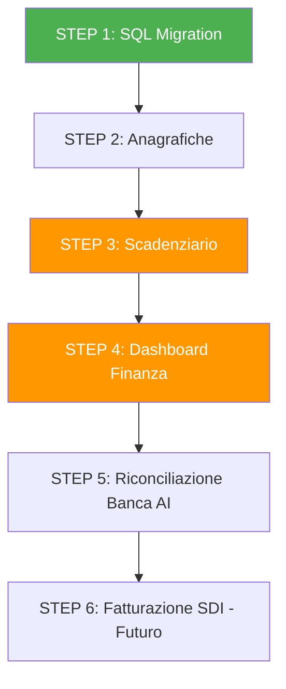
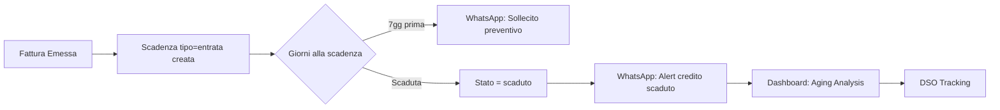

# 📊 Piano di Implementazione: Modulo Finanziario Integrato

> **Priorità dichiarata: Ottimizzazione Crediti** — Lo scadenziario entrate e la dashboard DSO vengono enfatizzati in ogni step.

---

## Architettura Attuale (Contesto)

| Componente | Stato |
|---|---|
| Framework | Next.js 16.1.6 + React 19 + TypeScript |
| DB | Supabase (PostgreSQL) con RLS + Service Role |
| UI | Tailwind 4 + shadcn/ui (card, badge, button, input, label, table) |
| AI | Gemini 2.5 Flash via REST API |
| Notifiche | WhatsApp Cloud API (Meta) |
| Cron | Vercel Cron → [`app/api/cron/scadenze/route.ts`](app/api/cron/scadenze/route.ts) |
| Sidebar | [`components/Sidebar.tsx`](components/Sidebar.tsx) — 3 link attuali |
| Data layer | [`utils/data-fetcher.ts`](utils/data-fetcher.ts) — 836 righe, pattern Admin client |
| XML Import | [`riconciliazione_xml.py`](riconciliazione_xml.py) — Python, legge FatturaPA XML |

### Pattern da seguire
- **Server Actions**: `'use server'` in `actions.ts` con `createClient()` da [`utils/supabase/server.ts`](utils/supabase/server.ts)
- **Data fetcher**: funzioni standalone con `getSupabaseAdmin()` (Service Role, bypassa RLS)
- **Pages**: Server Components con auth check `supabase.auth.getUser()` → redirect se non autenticato
- **Zero nuove dipendenze npm** — SVG nativo per grafici, CSV parsing manuale

---

## Flusso Generale



---

## STEP 1: SQL Migration — Schema Database Finanziario

### Obiettivo
Creare 3 tabelle + 1 VIEW + indici + RLS su Supabase.

### File da creare
- `supabase/migrations/20260220_modulo_finanziario.sql`

### Istruzioni passo-passo

**1.1** Crea il file SQL di migrazione con queste 3 tabelle:

#### Tabella `anagrafica_soggetti`
```sql
CREATE TABLE IF NOT EXISTS public.anagrafica_soggetti (
  id UUID DEFAULT gen_random_uuid() PRIMARY KEY,
  tipo TEXT NOT NULL CHECK (tipo IN ('fornitore', 'cliente')),
  ragione_sociale TEXT NOT NULL,
  partita_iva TEXT UNIQUE,
  codice_fiscale TEXT,
  indirizzo TEXT,
  email TEXT,
  telefono TEXT,
  pec TEXT,
  codice_sdi TEXT DEFAULT '0000000',
  iban TEXT,
  condizioni_pagamento TEXT DEFAULT '30gg DFFM',
  note TEXT,
  created_at TIMESTAMPTZ DEFAULT timezone('utc', now()) NOT NULL
);
```

#### Tabella `scadenze_pagamento`
```sql
CREATE TABLE IF NOT EXISTS public.scadenze_pagamento (
  id UUID DEFAULT gen_random_uuid() PRIMARY KEY,
  tipo TEXT NOT NULL CHECK (tipo IN ('entrata', 'uscita')),
  soggetto_id UUID REFERENCES public.anagrafica_soggetti(id) ON DELETE SET NULL,
  cantiere_id UUID REFERENCES public.cantieri(id) ON DELETE SET NULL,
  fattura_riferimento TEXT,
  descrizione TEXT,
  importo_totale NUMERIC NOT NULL DEFAULT 0,
  importo_pagato NUMERIC NOT NULL DEFAULT 0,
  data_emissione DATE,
  data_scadenza DATE NOT NULL,
  data_pagamento DATE,
  stato TEXT NOT NULL DEFAULT 'da_pagare'
    CHECK (stato IN ('da_pagare', 'parziale', 'pagato', 'scaduto')),
  metodo_pagamento TEXT,
  note TEXT,
  created_at TIMESTAMPTZ DEFAULT timezone('utc', now()) NOT NULL
);
```

#### Tabella `movimenti_banca`
```sql
CREATE TABLE IF NOT EXISTS public.movimenti_banca (
  id UUID DEFAULT gen_random_uuid() PRIMARY KEY,
  data_operazione DATE NOT NULL,
  data_valuta DATE,
  descrizione TEXT,
  importo NUMERIC NOT NULL,
  saldo_progressivo NUMERIC,
  scadenza_id UUID REFERENCES public.scadenze_pagamento(id) ON DELETE SET NULL,
  stato_riconciliazione TEXT NOT NULL DEFAULT 'non_riconciliato'
    CHECK (stato_riconciliazione IN ('non_riconciliato', 'riconciliato', 'parziale')),
  ai_suggerimento JSONB,
  created_at TIMESTAMPTZ DEFAULT timezone('utc', now()) NOT NULL
);
```

#### VIEW `vista_cashflow_previsionale`
```sql
CREATE OR REPLACE VIEW public.vista_cashflow_previsionale AS
SELECT
  s.id,
  s.tipo,
  s.data_scadenza,
  s.importo_totale,
  s.importo_pagato,
  (s.importo_totale - s.importo_pagato) AS importo_residuo,
  s.stato,
  s.fattura_riferimento,
  s.descrizione,
  a.ragione_sociale AS soggetto_nome,
  c.nome AS cantiere_nome,
  (s.data_scadenza - CURRENT_DATE) AS giorni_alla_scadenza,
  SUM(
    CASE WHEN s.tipo = 'entrata'
      THEN (s.importo_totale - s.importo_pagato)
      ELSE -(s.importo_totale - s.importo_pagato)
    END
  ) OVER (ORDER BY s.data_scadenza, s.id) AS saldo_progressivo_previsto
FROM public.scadenze_pagamento s
LEFT JOIN public.anagrafica_soggetti a ON s.soggetto_id = a.id
LEFT JOIN public.cantieri c ON s.cantiere_id = c.id
WHERE s.stato != 'pagato'
ORDER BY s.data_scadenza ASC;
```

**1.2** Aggiungi RLS + Policy:
```sql
ALTER TABLE public.anagrafica_soggetti ENABLE ROW LEVEL SECURITY;
ALTER TABLE public.scadenze_pagamento ENABLE ROW LEVEL SECURITY;
ALTER TABLE public.movimenti_banca ENABLE ROW LEVEL SECURITY;

CREATE POLICY "Accesso anagrafica" ON public.anagrafica_soggetti
  FOR ALL USING (auth.role() = 'authenticated');
CREATE POLICY "Accesso scadenze" ON public.scadenze_pagamento
  FOR ALL USING (auth.role() = 'authenticated');
CREATE POLICY "Accesso movimenti_banca" ON public.movimenti_banca
  FOR ALL USING (auth.role() = 'authenticated');
```

**1.3** Aggiungi indici per performance:
```sql
CREATE INDEX IF NOT EXISTS idx_scadenze_data ON scadenze_pagamento(data_scadenza);
CREATE INDEX IF NOT EXISTS idx_scadenze_stato ON scadenze_pagamento(stato);
CREATE INDEX IF NOT EXISTS idx_scadenze_tipo ON scadenze_pagamento(tipo);
CREATE INDEX IF NOT EXISTS idx_scadenze_soggetto ON scadenze_pagamento(soggetto_id);
CREATE INDEX IF NOT EXISTS idx_scadenze_cantiere ON scadenze_pagamento(cantiere_id);
CREATE INDEX IF NOT EXISTS idx_movimenti_banca_stato ON movimenti_banca(stato_riconciliazione);
CREATE INDEX IF NOT EXISTS idx_movimenti_banca_scadenza ON movimenti_banca(scadenza_id);
CREATE INDEX IF NOT EXISTS idx_anagrafica_tipo ON anagrafica_soggetti(tipo);
CREATE INDEX IF NOT EXISTS idx_anagrafica_piva ON anagrafica_soggetti(partita_iva);
```

**1.4** Aggiungi colonna `saldo_iniziale_banca` a `parametri_globali`:
```sql
ALTER TABLE parametri_globali
  ADD COLUMN IF NOT EXISTS saldo_iniziale_banca NUMERIC DEFAULT 0,
  ADD COLUMN IF NOT EXISTS soglia_alert_cassa NUMERIC DEFAULT 5000;
```

### Come eseguire
1. Apri **Supabase Dashboard** → SQL Editor
2. Copia-incolla l'intero contenuto del file SQL
3. Clicca **Run**
4. Verifica: vai su Table Editor → dovresti vedere `anagrafica_soggetti`, `scadenze_pagamento`, `movimenti_banca`
5. Verifica VIEW: SQL Editor → `SELECT * FROM vista_cashflow_previsionale LIMIT 5;` (restituirà 0 righe, OK)

### Verifica completamento
- [ ] 3 tabelle visibili in Table Editor
- [ ] VIEW restituisce risultato vuoto senza errori
- [ ] Indici creati (verifica con `\di` o nella sezione Indexes)

---

## STEP 2: Gestione Fornitori e Clienti (Anagrafiche)

### Obiettivo
CRUD completo per anagrafica soggetti con tabs Tutti/Fornitori/Clienti.

### File da creare

#### 2.1 — `app/anagrafiche/page.tsx` (Server Component)
- Auth check con redirect
- Query `anagrafica_soggetti` ordinata per `ragione_sociale`
- Tabs: Tutti | Fornitori | Clienti (filtro via searchParams `?tipo=fornitore`)
- Tabella con colonne: Ragione Sociale, P.IVA, Tipo, Telefono, Email, Condizioni Pagamento
- Badge colorato per tipo (verde=cliente, arancione=fornitore)
- Bottone "+ Nuovo Soggetto" che apre form inline o modale
- **KPI in alto**: Totale Fornitori, Totale Clienti, Crediti Aperti (somma scadenze entrata non pagate), Debiti Aperti (somma scadenze uscita non pagate)

#### 2.2 — `app/anagrafiche/actions.ts` (Server Actions)
- `addSoggetto(formData)` — insert in `anagrafica_soggetti`, revalidate `/anagrafiche`
- `editSoggetto(formData)` — update by id, revalidate
- `deleteSoggetto(formData)` — delete by id, revalidate
- Pattern: identico a [`app/cantieri/actions.ts`](app/cantieri/actions.ts:1) con `createClient()` da server

#### 2.3 — `app/anagrafiche/[id]/page.tsx` (Dettaglio Soggetto)
- Mostra tutti i campi del soggetto in form editabile
- Sezione "Storico Scadenze" — query `scadenze_pagamento` filtrate per `soggetto_id`
- **Per clienti**: evidenzia crediti aperti, giorni medi incasso (DSO per soggetto)
- **Per fornitori**: evidenzia debiti aperti, prossime scadenze
- Bottone "Modifica" / "Elimina"

#### 2.4 — Modifica [`components/Sidebar.tsx`](components/Sidebar.tsx:5)
- Aggiungere import `Building2` da lucide-react
- Aggiungere link `{ href: "/anagrafiche", label: "Anagrafiche", icon: Building2 }` all'array `links`

#### 2.5 — Aggiungere funzioni a [`utils/data-fetcher.ts`](utils/data-fetcher.ts:1)
- `getSoggetti(tipo?: string)` — lista con filtro opzionale
- `getSoggettoById(id: string)` — dettaglio singolo
- `upsertSoggettoDaPIVA(piva, ragione_sociale, tipo)` — upsert per import automatico da XML

#### 2.6 — Modifica [`riconciliazione_xml.py`](riconciliazione_xml.py:65)
- Dopo aver estratto `ragione_sociale` e `piva` dal CedentePrestatore
- Fare upsert su `anagrafica_soggetti` con `tipo='fornitore'`
- Usare `ON CONFLICT (partita_iva) DO UPDATE SET ragione_sociale = EXCLUDED.ragione_sociale`
- Questo popola automaticamente l'anagrafica fornitori da ogni fattura XML importata

### Verifica completamento
- [ ] Pagina `/anagrafiche` mostra tabella vuota con tabs funzionanti
- [ ] Crea fornitore manuale → appare in lista
- [ ] Esegui `riconciliazione_xml.py` → verifica auto-creazione fornitore in anagrafica
- [ ] Dettaglio soggetto mostra form editabile

---

## STEP 3: Scadenziario Pagamenti (PRIORITÀ CREDITI)

### Obiettivo
Gestione completa scadenze entrate/uscite con focus su **ottimizzazione crediti**: DSO, aging analysis, alert scaduti.

### File da creare

#### 3.1 — `app/scadenze/page.tsx` (Server Component)
- Auth check
- **KPI Cards in alto** (4 cards):
  1. 💰 **Da Incassare** — somma importo_residuo dove tipo='entrata' e stato != 'pagato' (VERDE)
  2. 💸 **Da Pagare** — somma importo_residuo dove tipo='uscita' e stato != 'pagato' (ROSSO)
  3. ⚠️ **Scaduto** — somma importo_residuo dove stato='scaduto' (ROSSO LAMPEGGIANTE)
  4. 📊 **DSO** — Days Sales Outstanding = media giorni incasso ultimi 90gg (GIALLO se > 60)
- **Tabs**: Tutte | Entrate | Uscite | Scadute
- **Tabella scadenze** con colonne: Soggetto, Fattura, Importo Totale, Pagato, Residuo, Scadenza, Stato, Azioni
- Badge stato colorato: verde=pagato, giallo=parziale, rosso=scaduto, grigio=da_pagare
- **Azioni per riga**: "Segna Pagato" (apre mini-form importo), "Dettaglio"
- **Ordinamento default**: scadute prima, poi per data_scadenza ASC
- **Filtro per cantiere** (select dropdown)

#### 3.2 — `app/scadenze/actions.ts` (Server Actions)
- `creaScadenza(formData)` — insert in `scadenze_pagamento`
  - Campi: tipo, soggetto_id, cantiere_id, fattura_riferimento, descrizione, importo_totale, data_emissione, data_scadenza, metodo_pagamento
  - Stato iniziale: 'da_pagare'
- `segnaComePagato(formData)` — aggiorna scadenza
  - Input: scadenza_id, importo_pagamento, data_pagamento, metodo_pagamento
  - Logica: `importo_pagato += importo_pagamento`
  - Se `importo_pagato >= importo_totale` → stato = 'pagato', data_pagamento = oggi
  - Se `importo_pagato > 0 && < importo_totale` → stato = 'parziale'
  - Revalidate `/scadenze`
- `aggiornaStatoScadute()` — chiamata dal cron
  - UPDATE scadenze_pagamento SET stato = 'scaduto' WHERE data_scadenza < CURRENT_DATE AND stato IN ('da_pagare', 'parziale')

#### 3.3 — Aggiungere funzioni a [`utils/data-fetcher.ts`](utils/data-fetcher.ts:1)
- `getScadenze(filtri?: { tipo?, stato?, cantiere_id? })` — lista con filtri
- `getScadenzaById(id)` — dettaglio singola
- `insertScadenza(data)` — insert
- `updatePagamento(id, importo, data, metodo)` — logica parziale/totale
- `getKPIScadenze()` — restituisce { da_incassare, da_pagare, scaduto, dso }
- `calcolaDSO()` — formula: media dei (data_pagamento - data_emissione) per scadenze tipo='entrata' pagate negli ultimi 90gg
- `getAgingAnalysis()` — raggruppa crediti per fasce: 0-30gg, 31-60gg, 61-90gg, >90gg

#### 3.4 — Modifica [`components/Sidebar.tsx`](components/Sidebar.tsx:5)
- Aggiungere import `CalendarCheck` da lucide-react
- Aggiungere link `{ href: "/scadenze", label: "Scadenze", icon: CalendarCheck }`

#### 3.5 — Modifica [`riconciliazione_xml.py`](riconciliazione_xml.py:76)
- Dopo insert fattura in `fatture_fornitori`:
  - Cercare il soggetto in `anagrafica_soggetti` per P.IVA
  - Calcolare data_scadenza da `condizioni_pagamento` del soggetto (default: data_fattura + 30gg)
  - Insert in `scadenze_pagamento` con tipo='uscita', importo_totale, data_emissione, data_scadenza
  - Questo crea automaticamente lo scadenziario passivo da ogni fattura importata

#### 3.6 — Estendere [`app/api/cron/scadenze/route.ts`](app/api/cron/scadenze/route.ts:1)
- **PARTE 3: SCADENZE PAGAMENTO** (nuova sezione)
  - Query scadenze con `data_scadenza` nei prossimi 7 giorni e `stato != 'pagato'`
  - Per ogni scadenza: invia WhatsApp all'admin
  - Formato messaggio:
    - Entrata: `💰 *Credito in scadenza*\nCliente: {nome}\nFattura: {rif}\nImporto: €{residuo}\nScade: {data}\n⚠️ Sollecitare incasso!`
    - Uscita: `💸 *Pagamento in scadenza*\nFornitore: {nome}\nFattura: {rif}\nImporto: €{residuo}\nScade: {data}`
  - Aggiornare stato scadenze scadute: `UPDATE ... SET stato = 'scaduto' WHERE data_scadenza < CURRENT_DATE AND stato IN ('da_pagare', 'parziale')`

### Logica Ottimizzazione Crediti (Core)



### Verifica completamento
- [ ] Crea scadenza entrata manuale → appare in lista
- [ ] Segna come pagata parziale → stato cambia a 'parziale'
- [ ] Segna resto → stato cambia a 'pagato'
- [ ] Cron: scadenze prossime 7gg generano WhatsApp
- [ ] KPI mostrano valori corretti
- [ ] DSO calcolato correttamente

---

## STEP 4: Dashboard Finanziaria

### Obiettivo
Vista d'insieme: previsionale di cassa, KPI globali, vista per cantiere.

### File da creare

#### 4.1 — `app/finanza/page.tsx` (Server Component)
- Auth check
- **Sezione 1: KPI Globali** (5 cards orizzontali)
  1. 🏦 **Saldo Attuale** — da `parametri_globali.saldo_iniziale_banca` + somma movimenti_banca
  2. 💰 **Fatturato** — somma scadenze tipo='entrata' (totale emesso)
  3. 💸 **Costi** — somma scadenze tipo='uscita' (totale impegnato)
  4. 📈 **Margine** — fatturato - costi
  5. 📊 **DSO** — Days Sales Outstanding (da `calcolaDSO()`)
- **Sezione 2: Grafico Cashflow Previsionale** (90 giorni)
  - Componente `<CashflowChart />` (client component)
  - Dati da `vista_cashflow_previsionale`
  - Linea saldo previsto con area colorata (verde sopra soglia, rosso sotto)
  - Alert visivo se saldo scende sotto `soglia_alert_cassa`
- **Sezione 3: Aging Analysis Crediti** (barre orizzontali)
  - 4 fasce: 0-30gg, 31-60gg, 61-90gg, >90gg
  - Importo totale per fascia + numero fatture
  - Colore progressivo: verde → giallo → arancione → rosso
- **Sezione 4: Mini-cards per Cantiere**
  - Per ogni cantiere aperto: entrate vs uscite, margine, % completamento
  - Click → va a dettaglio cantiere

#### 4.2 — `app/finanza/CashflowChart.tsx` (Client Component)
- `'use client'`
- Props: `data: Array<{ data: string, saldo: number, tipo: string }>`, `soglia: number`
- SVG nativo (ZERO librerie npm):
  - Asse X: date (ogni 7gg label)
  - Asse Y: importi in €
  - Linea saldo progressivo
  - Area sotto la linea: verde se > soglia, rosso se < soglia
  - Punti interattivi con tooltip (onMouseEnter)
  - Linea tratteggiata orizzontale per soglia alert
- Responsive: `viewBox` + `preserveAspectRatio`

#### 4.3 — `app/finanza/AgingChart.tsx` (Client Component)
- `'use client'`
- Barre orizzontali SVG per le 4 fasce aging
- Colori: `#22c55e` (0-30), `#eab308` (31-60), `#f97316` (61-90), `#ef4444` (>90)

#### 4.4 — Aggiungere funzioni a [`utils/data-fetcher.ts`](utils/data-fetcher.ts:1)
- `getCashflowPrevisionale(giorni: number)` — query VIEW, aggiunge saldo_iniziale
- `getKPIFinanziari()` — fatturato, costi, margine, DSO, saldo
- `getAgingAnalysis()` — raggruppa crediti scaduti per fasce temporali
- `getFinanzaPerCantiere()` — per ogni cantiere: entrate, uscite, margine

#### 4.5 — Modifica [`components/Sidebar.tsx`](components/Sidebar.tsx:5)
- Aggiungere import `TrendingUp` da lucide-react
- Aggiungere link `{ href: "/finanza", label: "Finanza", icon: TrendingUp }`

### Verifica completamento
- [ ] Dashboard mostra KPI con dati reali (o zero se vuoto)
- [ ] Grafico SVG renderizza correttamente con dati test
- [ ] Aging analysis mostra fasce colorate
- [ ] Mini-cards cantiere cliccabili
- [ ] Alert rosso se saldo sotto soglia

---

## STEP 5: Riconciliazione Bancaria AI

### Obiettivo
Upload CSV estratto conto → AI suggerisce match con scadenze → conferma/rifiuta umana.

### File da creare

#### 5.1 — `app/finanza/riconciliazione/page.tsx` (Server + Client)
- **Sezione Upload**: form con input file CSV + bottone "Importa"
- **Sezione Movimenti Non Riconciliati**: tabella con colonne:
  - Data, Descrizione (causale), Importo, Suggerimento AI, Confidence, Azioni
- **Azioni per riga**:
  - ✅ "Conferma Match" — collega movimento a scadenza suggerita
  - ❌ "Rifiuta" — rimuove suggerimento, resta non_riconciliato
  - 🔍 "Cerca Manuale" — dropdown scadenze aperte per match manuale
- **Badge confidence**: verde (>0.8), giallo (0.5-0.8), rosso (<0.5)

#### 5.2 — `app/finanza/riconciliazione/actions.ts` (Server Actions)
- `importaCSVBanca(formData)` — parse CSV, insert in `movimenti_banca`, chiama AI matching
- `confermaMatch(formData)` — aggiorna `movimenti_banca.scadenza_id`, stato='riconciliato', aggiorna scadenza (importo_pagato += importo movimento)
- `rifiutaMatch(formData)` — rimuove `ai_suggerimento`, stato resta 'non_riconciliato'
- `matchManuale(formData)` — collega manualmente movimento a scadenza

#### 5.3 — `app/api/finanza/riconcilia-banca/route.ts` (API Route)
- POST: riceve array di movimenti non riconciliati
- Per ogni movimento, chiama Gemini per suggerire match
- Restituisce array di suggerimenti con confidence score

#### 5.4 — Aggiungere a [`utils/ai/gemini.ts`](utils/ai/gemini.ts:1)
- `matchRiconciliazioneBancaria(movimento, scadenzeAperte)` — nuova funzione
- **Logica 3 livelli** (come DDT matching):
  1. **Match esatto** (confidence 0.95): importo identico + ragione_sociale trovata nella causale bancaria
  2. **Match fuzzy** (confidence 0.7): importo ±5% + data compatibile (±7gg dalla scadenza) + parole chiave nella causale
  3. **Suggerimento debole** (confidence 0.4): solo importo simile (±10%) → richiede conferma umana
- Prompt Gemini:
  ```
  Sei un assistente per riconciliazione bancaria.
  MOVIMENTO BANCA: data={data}, importo={importo}, causale="{descrizione}"
  SCADENZE APERTE: [lista con id, soggetto, importo_residuo, data_scadenza, fattura_rif]
  Trova la scadenza che corrisponde a questo movimento. Rispondi in JSON:
  {scadenza_id, confidence, motivo}
  ```

#### 5.5 — Aggiungere funzioni a [`utils/data-fetcher.ts`](utils/data-fetcher.ts:1)
- `importMovimentiBanca(movimenti[])` — bulk insert
- `getMovimentiNonRiconciliati()` — query con stato='non_riconciliato'
- `confermaRiconciliazione(movimento_id, scadenza_id)` — aggiorna entrambe le tabelle
- `parseCSVBanca(csvText: string)` — parser CSV generico (data, descrizione, importo, saldo)

#### 5.6 — Formato CSV supportato
Il parser deve gestire i formati più comuni delle banche italiane:
```
Data Operazione;Data Valuta;Descrizione;Dare;Avere;Saldo
20/02/2026;20/02/2026;BONIFICO DA ROSSI SRL - FATT 123;0;15000.00;45000.00
21/02/2026;21/02/2026;PAGAMENTO FORNITORE BIANCHI;8500.00;0;36500.00
```
- Separatore: `;` (punto e virgola, standard italiano)
- Date: `DD/MM/YYYY` → convertire in `YYYY-MM-DD`
- Dare = uscita (importo negativo), Avere = entrata (importo positivo)

### Verifica completamento
- [ ] Upload CSV → movimenti appaiono in tabella
- [ ] AI suggerisce match con confidence visibile
- [ ] Conferma match → scadenza aggiornata (importo_pagato incrementato)
- [ ] Rifiuta match → suggerimento rimosso
- [ ] Match manuale funziona con dropdown

---

## STEP 6: Fatturazione Integrata (Pianificazione Futura)

> ⚠️ **Richiede decisione su provider SDI** — Non implementare ora.

### Opzioni Provider
| Provider | Pro | Contro |
|---|---|---|
| Aruba PEC/Fattura | Economico, diffuso in Italia | API limitata |
| Fattura24 | API REST moderna, buona docs | Costo mensile |
| OpenAPI (Fatture in Cloud) | API completa, webhook | Più costoso |

### Funzionalità future
- Generazione XML FatturaPA da computo confermato + SAL
- Invio/ricezione via API provider
- Integrazione cassetto fiscale
- Auto-creazione scadenze da fatture emesse

### Decisione necessaria
Prima di procedere, scegliere il provider e ottenere le credenziali API.

---

## Ordine di Esecuzione Dettagliato

### Sequenza file per file

```
STEP 1 (1 file SQL):
  └─ supabase/migrations/20260220_modulo_finanziario.sql

STEP 2 (5 file + 2 modifiche):
  ├─ app/anagrafiche/page.tsx          [NUOVO]
  ├─ app/anagrafiche/actions.ts        [NUOVO]
  ├─ app/anagrafiche/[id]/page.tsx     [NUOVO]
  ├─ components/Sidebar.tsx            [MODIFICA: +Building2]
  ├─ utils/data-fetcher.ts             [MODIFICA: +3 funzioni]
  └─ riconciliazione_xml.py            [MODIFICA: +upsert anagrafica]

STEP 3 (3 file + 3 modifiche):
  ├─ app/scadenze/page.tsx             [NUOVO]
  ├─ app/scadenze/actions.ts           [NUOVO]
  ├─ components/Sidebar.tsx            [MODIFICA: +CalendarCheck]
  ├─ utils/data-fetcher.ts             [MODIFICA: +6 funzioni]
  ├─ riconciliazione_xml.py            [MODIFICA: +auto-scadenza]
  └─ app/api/cron/scadenze/route.ts    [MODIFICA: +PARTE 3]

STEP 4 (3 file + 2 modifiche):
  ├─ app/finanza/page.tsx              [NUOVO]
  ├─ app/finanza/CashflowChart.tsx     [NUOVO]
  ├─ app/finanza/AgingChart.tsx        [NUOVO]
  ├─ components/Sidebar.tsx            [MODIFICA: +TrendingUp]
  └─ utils/data-fetcher.ts             [MODIFICA: +4 funzioni]

STEP 5 (3 file + 2 modifiche):
  ├─ app/finanza/riconciliazione/page.tsx      [NUOVO]
  ├─ app/finanza/riconciliazione/actions.ts    [NUOVO]
  ├─ app/api/finanza/riconcilia-banca/route.ts [NUOVO]
  ├─ utils/ai/gemini.ts               [MODIFICA: +matchRiconciliazioneBancaria]
  └─ utils/data-fetcher.ts             [MODIFICA: +4 funzioni]
```

### Totale file
| Tipo | Conteggio |
|---|---|
| File NUOVI | 12 |
| File MODIFICATI | 5 (alcuni modificati in più step) |
| File SQL | 1 |
| **TOTALE** | **13 file unici** |

---

## Checklist Operativa Completa (Copia-Incolla)

Usa questa checklist per tracciare il progresso. Ogni punto è un'azione atomica.

### STEP 1: Database
- [ ] Creare file `supabase/migrations/20260220_modulo_finanziario.sql`
- [ ] Eseguire SQL su Supabase Dashboard → SQL Editor → Run
- [ ] Verificare tabella `anagrafica_soggetti` in Table Editor
- [ ] Verificare tabella `scadenze_pagamento` in Table Editor
- [ ] Verificare tabella `movimenti_banca` in Table Editor
- [ ] Verificare VIEW: `SELECT * FROM vista_cashflow_previsionale LIMIT 1;`
- [ ] Verificare colonne aggiunte a `parametri_globali`

### STEP 2: Anagrafiche
- [ ] Creare `app/anagrafiche/actions.ts` con addSoggetto, editSoggetto, deleteSoggetto
- [ ] Creare `app/anagrafiche/page.tsx` con tabella + tabs + KPI
- [ ] Creare `app/anagrafiche/[id]/page.tsx` con dettaglio + storico
- [ ] Aggiungere funzioni CRUD a `utils/data-fetcher.ts`
- [ ] Aggiungere link Anagrafiche a `components/Sidebar.tsx`
- [ ] Modificare `riconciliazione_xml.py` per upsert anagrafica fornitori
- [ ] TEST: Creare fornitore manuale → verificare in lista
- [ ] TEST: Eseguire import XML → verificare auto-creazione fornitore

### STEP 3: Scadenziario (PRIORITÀ CREDITI)
- [ ] Creare `app/scadenze/actions.ts` con creaScadenza, segnaComePagato
- [ ] Creare `app/scadenze/page.tsx` con KPI + tabella + filtri
- [ ] Aggiungere funzioni scadenze a `utils/data-fetcher.ts` (getScadenze, calcolaDSO, getAgingAnalysis)
- [ ] Aggiungere link Scadenze a `components/Sidebar.tsx`
- [ ] Modificare `riconciliazione_xml.py` per auto-creazione scadenze da fatture
- [ ] Estendere cron `app/api/cron/scadenze/route.ts` con PARTE 3 (notifiche pagamento)
- [ ] TEST: Creare scadenza entrata → segna pagata parziale → segna pagata totale
- [ ] TEST: Verificare DSO calcolato
- [ ] TEST: Verificare cron WhatsApp per scadenze prossime

### STEP 4: Dashboard Finanziaria
- [ ] Creare `app/finanza/CashflowChart.tsx` (SVG nativo)
- [ ] Creare `app/finanza/AgingChart.tsx` (SVG nativo)
- [ ] Creare `app/finanza/page.tsx` con KPI + grafici + mini-cards
- [ ] Aggiungere funzioni dashboard a `utils/data-fetcher.ts`
- [ ] Aggiungere link Finanza a `components/Sidebar.tsx`
- [ ] TEST: Inserire scadenze test → verificare grafico + KPI
- [ ] TEST: Verificare alert soglia cassa

### STEP 5: Riconciliazione Bancaria AI
- [ ] Aggiungere `matchRiconciliazioneBancaria()` a `utils/ai/gemini.ts`
- [ ] Aggiungere funzioni banca a `utils/data-fetcher.ts` (parseCSV, import, riconcilia)
- [ ] Creare `app/api/finanza/riconcilia-banca/route.ts` (API AI matching)
- [ ] Creare `app/finanza/riconciliazione/actions.ts` (conferma/rifiuta)
- [ ] Creare `app/finanza/riconciliazione/page.tsx` (upload + tabella)
- [ ] TEST: Upload CSV banca → verificare movimenti importati
- [ ] TEST: Verificare suggerimenti AI con confidence
- [ ] TEST: Conferma match → verificare aggiornamento scadenza

---

## Note Tecniche Importanti

### Pattern da rispettare
1. **Auth check**: Ogni `page.tsx` deve iniziare con `const supabase = await createClient()` + `getUser()` + redirect
2. **Server Actions**: Usare `'use server'` + `createClient()` da `@/utils/supabase/server` (NON admin)
3. **Data fetcher**: Usare `getSupabaseAdmin()` (Service Role) per query server-side
4. **Revalidation**: Dopo ogni mutazione, chiamare `revalidatePath('/percorso')`
5. **Sidebar**: L'array `links` è l'unico punto da modificare, il rendering è automatico

### Convenzioni naming
- Tabelle DB: `snake_case` (es. `scadenze_pagamento`)
- Funzioni TS: `camelCase` (es. `getScadenze`)
- File pages: `page.tsx` (Next.js App Router convention)
- Server Actions: `actions.ts` nella stessa cartella della page

### Gestione errori
- Ogni funzione in data-fetcher deve avere try/catch con console.error
- Le Server Actions devono fare redirect con `?error=` in caso di errore
- Le API routes devono restituire `NextResponse.json({ error })` con status code appropriato

### CSV Parsing (Step 5)
- NON usare librerie npm — parsing manuale con `split(';')` e `split('\n')`
- Gestire encoding UTF-8 con BOM (i CSV italiani spesso hanno BOM)
- Convertire date `DD/MM/YYYY` → `YYYY-MM-DD`
- Gestire importi con virgola decimale: `"1.500,00"` → `1500.00`