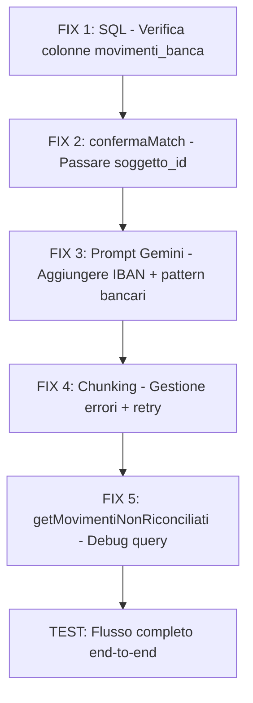

# 🔧 Piano Fix: Riconciliazione Bancaria — 3 Problemi Critici

> Analisi completa del codice attuale e piano di fix a prova di scemo.

---

## Diagnosi dei 3 Problemi

### PROBLEMA 1: Gemini non estrae il beneficiario dalla causale bancaria
**Causa radice**: Il prompt Gemini è ben scritto MA il problema è nel **formato dati inviati**. Nella [`route.ts`](app/api/finanza/riconcilia-banca/route.ts:16) le scadenze vengono caricate con il join `anagrafica_soggetti(ragione_sociale, partita_iva)` — ma Supabase restituisce il join come oggetto annidato `anagrafica_soggetti: { ragione_sociale, partita_iva }`. Nel prompt di [`gemini.ts`](utils/ai/gemini.ts:603) si accede correttamente a `s.anagrafica_soggetti?.ragione_sociale`, **MA** il vero problema è che:

1. **Mancano gli IBAN dei soggetti nel prompt** — Le causali bancarie spesso contengono l'IBAN del beneficiario (es. `BON SEPA A FAV DI ... IBAN IT60X...`), ma il prompt non fornisce gli IBAN dei soggetti a Gemini, quindi non può fare il match.
2. **Mancano le parole chiave tipiche** — Le causali bancarie italiane hanno pattern fissi (`BON A FAV`, `PAGO FATT`, `GIRO FONDI`, `RID`, `SDD`, `MAV`, `RIBA`) che Gemini non sa interpretare senza istruzioni esplicite.
3. **Il chunk da 20 movimenti + tutte le scadenze** può generare un prompt enorme che Gemini processa superficialmente — meglio dare istruzioni più strutturate e compatte.

### PROBLEMA 2: Analisi superficiale / non tutte le righe analizzate
**Causa radice**: Il chunking client-side in [`ClientRiconciliazione.tsx`](app/finanza/riconciliazione/ClientRiconciliazione.tsx:40) funziona, MA:

1. Il filtro `movimentiLocali.filter(m => !m.ai_motivo)` alla riga 41 usa `ai_motivo` come flag "già analizzato". Ma se un chunk fallisce (errore Gemini, timeout), quei movimenti **non ricevono mai `ai_motivo`** e al prossimo click vengono ri-analizzati, creando confusione.
2. Il delay di 15 secondi tra chunk è eccessivo — Gemini 2.5 Flash ha rate limit generosi. 3-5 secondi bastano.
3. **Il vero problema**: quando il chunk API fallisce (500, timeout), il `catch` logga l'errore ma **non aggiorna lo stato locale** di quei movimenti, quindi sembrano "non analizzati" anche se l'API ha risposto parzialmente.
4. La risposta Gemini a volte restituisce meno risultati del previsto (non uno per movimento) — il codice non gestisce questo caso.

### PROBLEMA 3: Conferma match non visibile in anagrafica + movimento riappare
**Causa radice**: Ci sono **2 bug concatenati**:

**Bug 3A — Il movimento riappare in riconciliazione:**
- [`confermaMatch`](app/finanza/riconciliazione/actions.ts:30) chiama [`confermaRiconciliazione`](utils/data-fetcher.ts:1513) che aggiorna `stato = 'riconciliato'`
- MA [`actions.ts`](app/finanza/riconciliazione/actions.ts:33) passa solo 3 parametri: `(movimento_id, scadenza_id, importo)` — manca il `soggetto_id`!
- La funzione [`confermaRiconciliazione`](utils/data-fetcher.ts:1513) accetta `soggetto_id` come parametro opzionale (riga 1518), ma non viene mai passato dalla action
- Risultato: il `soggetto_id` sul movimento resta `null` → lo storico pagamenti in anagrafica (che filtra per `soggetto_id`) non lo trova

**Bug 3B — Non visibile in anagrafica:**
- [`getStoricoPaymentsSoggetto`](utils/data-fetcher.ts:1617) filtra con `.eq('soggetto_id', soggetto_id)` — ma se il `soggetto_id` non è stato salvato sul movimento durante la conferma, il filtro non trova nulla
- Inoltre, [`getMovimentiNonRiconciliati`](utils/data-fetcher.ts:1486) filtra con `.eq('stato', 'non_riconciliato')` — se lo stato è stato aggiornato correttamente a `'riconciliato'`, il movimento NON dovrebbe riapparire. **Se riappare, significa che l'update dello stato sta fallendo silenziosamente** (probabilmente un errore RLS o un campo mancante nella tabella `movimenti_banca`)

---

## Piano di Fix — Ordine di Esecuzione



---

## FIX 1: Verifica Schema DB `movimenti_banca`

### Problema
La tabella `movimenti_banca` potrebbe non avere le colonne `soggetto_id`, `ai_confidence`, `ai_motivo`, `auto_riconciliato` che il codice usa. Se mancano, gli UPDATE falliscono silenziosamente.

### Azione — SQL da eseguire su Supabase Dashboard

```sql
-- Verifica colonne esistenti
SELECT column_name, data_type 
FROM information_schema.columns 
WHERE table_name = 'movimenti_banca' 
ORDER BY ordinal_position;

-- Aggiungi colonne mancanti (esegui solo quelle che mancano)
ALTER TABLE public.movimenti_banca
  ADD COLUMN IF NOT EXISTS soggetto_id UUID REFERENCES public.anagrafica_soggetti(id) ON DELETE SET NULL,
  ADD COLUMN IF NOT EXISTS ai_confidence NUMERIC DEFAULT 0,
  ADD COLUMN IF NOT EXISTS ai_motivo TEXT,
  ADD COLUMN IF NOT EXISTS auto_riconciliato BOOLEAN DEFAULT false,
  ADD COLUMN IF NOT EXISTS conto_banca_id UUID,
  ADD COLUMN IF NOT EXISTS upload_id UUID;

-- Indice per lo storico pagamenti per soggetto
CREATE INDEX IF NOT EXISTS idx_movimenti_banca_soggetto ON movimenti_banca(soggetto_id);
CREATE INDEX IF NOT EXISTS idx_movimenti_banca_stato ON movimenti_banca(stato);

-- Verifica che la policy RLS permetta UPDATE
-- Se usi Service Role (getSupabaseAdmin) questo non è un problema
-- Ma se usi createClient() da server (come in rifiutaMatch), potrebbe bloccare
-- FIX: Assicurati che la policy permetta UPDATE per utenti autenticati
DROP POLICY IF EXISTS "Accesso movimenti_banca" ON public.movimenti_banca;
CREATE POLICY "Accesso movimenti_banca" ON public.movimenti_banca
  FOR ALL USING (auth.role() = 'authenticated');
```

### Verifica
- [ ] Eseguire la query `SELECT column_name...` e verificare che `soggetto_id`, `ai_confidence`, `ai_motivo`, `stato` esistano
- [ ] Se mancano, eseguire gli ALTER TABLE
- [ ] Verificare policy RLS

---

## FIX 2: `confermaMatch` — Passare `soggetto_id` correttamente

### File: [`app/finanza/riconciliazione/actions.ts`](app/finanza/riconciliazione/actions.ts:30)

**Problema**: La action `confermaMatch` non passa `soggetto_id` a `confermaRiconciliazione`, quindi il movimento viene marcato come riconciliato ma senza link al soggetto.

**Fix**: Leggere `soggetto_id` dal formData e passarlo alla funzione.

```typescript
// PRIMA (riga 30-51):
export async function confermaMatch(formData: FormData) {
  try {
    const movimento_id = formData.get('movimento_id') as string;
    const scadenza_id = formData.get('scadenza_id') as string;
    const importo = Number(formData.get('importo'));

    if (!movimento_id || !scadenza_id) {
      throw new Error("Dati mancanti per la conferma della riconciliazione.");
    }

    await confermaRiconciliazione(movimento_id, scadenza_id, importo);
    // ...
  }
}

// DOPO:
export async function confermaMatch(formData: FormData) {
  try {
    const movimento_id = formData.get('movimento_id') as string;
    const scadenza_id = formData.get('scadenza_id') as string;
    const soggetto_id = formData.get('soggetto_id') as string | null;
    const importo = Number(formData.get('importo'));

    if (!movimento_id) {
      throw new Error("ID movimento mancante.");
    }

    // Se non c'è scadenza_id ma c'è soggetto_id, è un acconto generico
    // Dobbiamo comunque riconciliare il movimento (marcarlo come gestito)
    if (scadenza_id) {
      await confermaRiconciliazione(
        movimento_id, 
        scadenza_id, 
        importo, 
        'confermato_utente',
        soggetto_id || undefined
      );
    } else if (soggetto_id) {
      // Acconto senza fattura specifica: segna solo come riconciliato con soggetto
      const supabase = await createClient();
      await supabase
        .from('movimenti_banca')
        .update({ 
          stato: 'riconciliato', 
          soggetto_id: soggetto_id 
        })
        .eq('id', movimento_id);
    }

    revalidatePath('/finanza/riconciliazione');
    revalidatePath('/finanza');
    revalidatePath('/scadenze');
    revalidatePath('/anagrafiche');  // <-- AGGIUNTO: invalida anche la cache anagrafica
    return { success: true };
  } catch (error: any) {
    console.error("❌ Errore conferma match:", error);
    return { error: error.message };
  }
}
```

### File: [`app/finanza/riconciliazione/ClientRiconciliazione.tsx`](app/finanza/riconciliazione/ClientRiconciliazione.tsx:217)

**Problema**: Il form di conferma passa `soggetto_id` solo se presente nel movimento (riga 220), ma per il match manuale (dropdown) non viene passato.

**Fix**: Quando l'utente seleziona una scadenza dal dropdown manuale, estrarre anche il `soggetto_id` dalla scadenza selezionata.

Il form manuale (riga 234-247) deve includere un hidden field per `soggetto_id` che viene popolato quando l'utente seleziona una scadenza dal dropdown. Questo richiede di trasformare il select in un componente controllato.

---

## FIX 3: Prompt Gemini — Aggiungere IBAN + Pattern Bancari

### File: [`utils/ai/gemini.ts`](utils/ai/gemini.ts:594) — funzione `matchBatchRiconciliazioneBancaria`

### File: [`app/api/finanza/riconcilia-banca/route.ts`](app/api/finanza/riconcilia-banca/route.ts:16) — query scadenze

**Problema 3A**: La query nella route non include l'IBAN del soggetto.

**Fix route.ts**: Aggiungere `iban` al select del join:
```typescript
// PRIMA:
.select('id, fattura_riferimento, importo_totale, importo_pagato, data_scadenza, tipo, soggetto_id, descrizione, anagrafica_soggetti(ragione_sociale, partita_iva)')

// DOPO:
.select('id, fattura_riferimento, importo_totale, importo_pagato, data_scadenza, tipo, soggetto_id, descrizione, anagrafica_soggetti(ragione_sociale, partita_iva, iban)')
```

**Problema 3B**: Il prompt Gemini non include IBAN e non spiega i pattern bancari italiani.

**Fix gemini.ts** — Riscrivere il prompt con queste migliorie:

1. **Includere IBAN** nel JSON delle scadenze inviate a Gemini
2. **Aggiungere sezione "PATTERN CAUSALI BANCARIE ITALIANE"** con esempi reali
3. **Ridurre la verbosità** del JSON inviato (solo campi essenziali)
4. **Aggiungere istruzione esplicita**: "Cerca l'IBAN nella causale e confrontalo con gli IBAN dei soggetti"

```typescript
// Nel prompt, sezione FATTURE/SCADENZE APERTE, aggiungere iban:
${JSON.stringify(scadenzeAperte.map(s => ({
    id: s.id,
    soggetto_id: s.soggetto_id,
    nome: s.anagrafica_soggetti?.ragione_sociale || '',
    piva: s.anagrafica_soggetti?.partita_iva || '',
    iban: s.anagrafica_soggetti?.iban || '',  // <-- AGGIUNTO
    residuo: Number(s.importo_totale) - Number(s.importo_pagato || 0),
    fatt: s.fattura_riferimento,
    tipo: s.tipo
})), null, 2)}

// Aggiungere al prompt PRIMA del metodo di lavoro:
DIZIONARIO CAUSALI BANCARIE ITALIANE:
- "BON" o "BONIF" = Bonifico
- "A FAV" o "A FAVORE" = destinatario del pagamento
- "DA" o "DISP" = ordinante del pagamento (chi paga)
- "RID" o "SDD" = Addebito diretto SEPA (utenze, rate)
- "RIBA" o "RI.BA" = Ricevuta Bancaria (pagamento fornitore)
- "MAV" = Pagamento mediante avviso
- "PAGO" o "PAG" = Pagamento
- "FATT" o "FT" o "FATTURA" = Riferimento fattura
- "IBAN" seguito da codice = IBAN del beneficiario/ordinante
- "CRO" o "TRN" = Codice riferimento operazione

STRATEGIA DI MATCHING (in ordine di priorità):
1. Cerca un IBAN nella causale (formato ITxx...) e confrontalo con gli IBAN dei soggetti
2. Cerca il nome/ragione sociale nella causale (fuzzy, ignora Srl/SpA/suffissi)
3. Cerca la Partita IVA nella causale (11 cifre)
4. Cerca un numero fattura nella causale e confrontalo con i riferimenti fattura
5. Confronta l'importo del movimento con gli importi residui delle scadenze
```

---

## FIX 4: Chunking — Gestione Errori + Retry

### File: [`app/finanza/riconciliazione/ClientRiconciliazione.tsx`](app/finanza/riconciliazione/ClientRiconciliazione.tsx:40)

**Problemi**:
1. Se un chunk fallisce, i movimenti di quel chunk restano senza `ai_motivo` e sembrano "non analizzati"
2. Delay 15s eccessivo
3. Nessun retry su errore

**Fix**:

```typescript
const handleAiAnalysis = async () => {
    const daAnalizzare = movimentiLocali.filter(m => !m.ai_motivo)
    if (daAnalizzare.length === 0) return;

    setIsAnalyzing(true)
    
    const CHUNK_SIZE = 15;  // Ridotto da 20 a 15 per prompt più gestibili
    setProgress({ current: 0, total: daAnalizzare.length });

    for (let i = 0; i < daAnalizzare.length; i += CHUNK_SIZE) {
      const chunk = daAnalizzare.slice(i, i + CHUNK_SIZE);
      let success = false;
      let retries = 0;
      
      while (!success && retries < 2) {  // Max 2 tentativi per chunk
        try {
          const response = await fetch('/api/finanza/riconcilia-banca', {
            method: 'POST',
            headers: { 'Content-Type': 'application/json' },
            body: JSON.stringify({ movimenti: chunk })
          });
          
          if (!response.ok) {
            throw new Error(`HTTP ${response.status}`);
          }
          
          const data = await response.json();
          
          if (data.risultati && Array.isArray(data.risultati)) {
            // Crea un Set degli ID ricevuti per verificare completezza
            const receivedIds = new Set(data.risultati.map((r: any) => r.movimento_id));
            
            setMovimentiLocali((prevMovimenti) => 
              prevMovimenti.map((mov) => {
                const match = data.risultati.find((r: any) => r.movimento_id === mov.id);
                if (match) {
                  return { 
                    ...mov, 
                    ai_suggerimento: match.scadenza_id || null, 
                    soggetto_id: match.soggetto_id || null,
                    ai_confidence: match.confidence || 0, 
                    ai_motivo: match.motivo || "Analisi completata"
                  };
                }
                // FIX: Se il movimento era nel chunk ma Gemini non ha risposto per lui,
                // segnalo comunque come "analizzato" per evitare loop infiniti
                if (chunk.some(c => c.id === mov.id) && !receivedIds.has(mov.id)) {
                  return {
                    ...mov,
                    ai_motivo: "AI non ha fornito risposta per questo movimento",
                    ai_confidence: 0
                  };
                }
                return mov;
              })
            );
            success = true;
          }
        } catch (error) {
          retries++;
          console.error(`❌ Errore chunk ${Math.floor(i/CHUNK_SIZE) + 1}, tentativo ${retries}:`, error);
          
          if (retries >= 2) {
            // Dopo 2 tentativi falliti, segna i movimenti del chunk come "errore"
            setMovimentiLocali((prevMovimenti) => 
              prevMovimenti.map((mov) => {
                if (chunk.some(c => c.id === mov.id) && !mov.ai_motivo) {
                  return {
                    ...mov,
                    ai_motivo: "Errore analisi AI - riprovare",
                    ai_confidence: 0
                  };
                }
                return mov;
              })
            );
          } else {
            // Aspetta prima di riprovare
            await new Promise(resolve => setTimeout(resolve, 5000));
          }
        }
      }

      const processed = Math.min(i + CHUNK_SIZE, daAnalizzare.length);
      setProgress({ current: processed, total: daAnalizzare.length });
      
      // Delay ridotto: 3 secondi tra chunk (Gemini 2.5 Flash ha rate limit generosi)
      if (processed < daAnalizzare.length) {
        await new Promise(resolve => setTimeout(resolve, 3000));
      }
    }

    setIsAnalyzing(false)
    setProgress({ current: 0, total: 0 })
    router.refresh();
  }
```

---

## FIX 5: `rifiutaMatch` — Usare Admin Client

### File: [`app/finanza/riconciliazione/actions.ts`](app/finanza/riconciliazione/actions.ts:54)

**Problema**: `rifiutaMatch` usa `createClient()` (client autenticato con RLS) invece di `getSupabaseAdmin()` (Service Role). Se la policy RLS non permette UPDATE, l'operazione fallisce silenziosamente.

**Fix**: Usare lo stesso pattern di `confermaRiconciliazione` che usa `getSupabaseAdmin()`.

```typescript
// PRIMA:
export async function rifiutaMatch(formData: FormData) {
  const supabase = await createClient();  // <-- Soggetto a RLS!
  // ...
}

// DOPO:
import { createClient as createAdminClient } from "@supabase/supabase-js";

export async function rifiutaMatch(formData: FormData) {
  const movimento_id = formData.get('movimento_id') as string;
  if (!movimento_id) throw new Error("ID movimento mancante.");

  // Usa Service Role per bypassare RLS (stesso pattern di data-fetcher)
  const supabase = createAdminClient(
    process.env.NEXT_PUBLIC_SUPABASE_URL!,
    process.env.SUPABASE_SERVICE_ROLE_KEY!,
    { auth: { persistSession: false } }
  );
  
  const { error } = await supabase
    .from('movimenti_banca')
    .update({ 
      ai_suggerimento: null, 
      soggetto_id: null,
      ai_confidence: null, 
      ai_motivo: null 
    })
    .eq('id', movimento_id);

  if (error) {
    console.error("❌ Errore rifiuto match:", error);
    throw error;
  }

  revalidatePath('/finanza/riconciliazione');
  return { success: true };
}
```

**Alternativa migliore**: Importare e usare una funzione da `data-fetcher.ts` che già usa `getSupabaseAdmin()`, mantenendo il pattern consistente.

---

## FIX 6: Match Manuale — Passare `soggetto_id` dal Dropdown

### File: [`app/finanza/riconciliazione/ClientRiconciliazione.tsx`](app/finanza/riconciliazione/ClientRiconciliazione.tsx:234)

**Problema**: Il dropdown manuale non passa `soggetto_id` quando l'utente seleziona una scadenza.

**Fix**: Trasformare il select in un componente controllato che popola un hidden field `soggetto_id`.

```tsx
// Aggiungere stato per tracciare la selezione manuale per ogni movimento
const [manualSelections, setManualSelections] = useState<Record<string, string>>({});

// Nel form manuale, sostituire il select con:
<select 
  name="scadenza_id" 
  required 
  className="h-8 text-xs border border-zinc-200 rounded px-2 w-[150px] outline-none"
  onChange={(e) => {
    const selectedScadenza = scadenzeAperte.find(s => s.id === e.target.value);
    if (selectedScadenza) {
      setManualSelections(prev => ({
        ...prev,
        [m.id]: selectedScadenza.soggetto_id || ''
      }));
    }
  }}
>
  <option value="">Seleziona manuale...</option>
  {scadenzeAperte
    .filter(s => (m.importo > 0 ? s.tipo === 'entrata' : s.tipo === 'uscita'))
    .map(s => (
      <option key={s.id} value={s.id}>
        {s.soggetto?.ragione_sociale || s.anagrafica_soggetti?.ragione_sociale} - {formatEuro(s.importo_totale)}
      </option>
    ))}
</select>
<input type="hidden" name="soggetto_id" value={manualSelections[m.id] || ''} />
```

---

## Checklist Operativa (Ordine di Esecuzione)

### Fase 1: Database (5 minuti)
- [ ] Eseguire query verifica colonne su Supabase Dashboard
- [ ] Eseguire ALTER TABLE per colonne mancanti
- [ ] Verificare/ricreare policy RLS su `movimenti_banca`

### Fase 2: Fix Backend (conferma + rifiuto)
- [ ] Modificare [`app/finanza/riconciliazione/actions.ts`](app/finanza/riconciliazione/actions.ts) — `confermaMatch`: aggiungere `soggetto_id` dal formData
- [ ] Modificare [`app/finanza/riconciliazione/actions.ts`](app/finanza/riconciliazione/actions.ts) — `confermaMatch`: gestire caso acconto (soggetto senza scadenza)
- [ ] Modificare [`app/finanza/riconciliazione/actions.ts`](app/finanza/riconciliazione/actions.ts) — `rifiutaMatch`: usare Admin client
- [ ] Aggiungere `revalidatePath('/anagrafiche')` in `confermaMatch`

### Fase 3: Fix Prompt AI
- [ ] Modificare [`app/api/finanza/riconcilia-banca/route.ts`](app/api/finanza/riconcilia-banca/route.ts:18) — aggiungere `iban` al select join
- [ ] Modificare [`utils/ai/gemini.ts`](utils/ai/gemini.ts:594) — aggiungere IBAN al JSON scadenze
- [ ] Modificare [`utils/ai/gemini.ts`](utils/ai/gemini.ts:594) — aggiungere dizionario causali bancarie al prompt
- [ ] Modificare [`utils/ai/gemini.ts`](utils/ai/gemini.ts:594) — aggiungere strategia matching con priorità IBAN

### Fase 4: Fix Frontend (chunking + UI)
- [ ] Modificare [`ClientRiconciliazione.tsx`](app/finanza/riconciliazione/ClientRiconciliazione.tsx) — ridurre chunk a 15, delay a 3s
- [ ] Modificare [`ClientRiconciliazione.tsx`](app/finanza/riconciliazione/ClientRiconciliazione.tsx) — aggiungere retry (max 2) per chunk falliti
- [ ] Modificare [`ClientRiconciliazione.tsx`](app/finanza/riconciliazione/ClientRiconciliazione.tsx) — gestire movimenti senza risposta AI (segnare come "errore")
- [ ] Modificare [`ClientRiconciliazione.tsx`](app/finanza/riconciliazione/ClientRiconciliazione.tsx) — match manuale: passare `soggetto_id` dal dropdown
- [ ] Aggiungere stato `manualSelections` per tracciare selezione dropdown

### Fase 5: Test End-to-End
- [ ] Upload CSV con 5-10 movimenti test
- [ ] Avviare analisi AI → verificare che TUTTI i movimenti ricevano risposta
- [ ] Verificare che Gemini identifichi correttamente i beneficiari (controllare `ai_motivo`)
- [ ] Confermare un match AI → verificare che sparisca dalla lista riconciliazione
- [ ] Andare in anagrafica del soggetto → verificare che il movimento appaia nello storico
- [ ] Rifiutare un match → verificare che il suggerimento venga rimosso
- [ ] Match manuale con dropdown → verificare che funzioni come conferma AI
- [ ] Verificare che le scadenze vengano aggiornate (importo_pagato incrementato)

---

## Riepilogo Modifiche per File

| File | Tipo | Descrizione |
|---|---|---|
| SQL Supabase | ALTER | Aggiungere colonne mancanti + policy RLS |
| [`actions.ts`](app/finanza/riconciliazione/actions.ts) | FIX | confermaMatch: +soggetto_id, +acconto; rifiutaMatch: admin client |
| [`route.ts`](app/api/finanza/riconcilia-banca/route.ts) | FIX | +iban nel select join scadenze |
| [`gemini.ts`](utils/ai/gemini.ts) | FIX | Prompt: +IBAN, +dizionario causali, +strategia matching |
| [`ClientRiconciliazione.tsx`](app/finanza/riconciliazione/ClientRiconciliazione.tsx) | FIX | Chunking: retry+errori; Dropdown: +soggetto_id |
