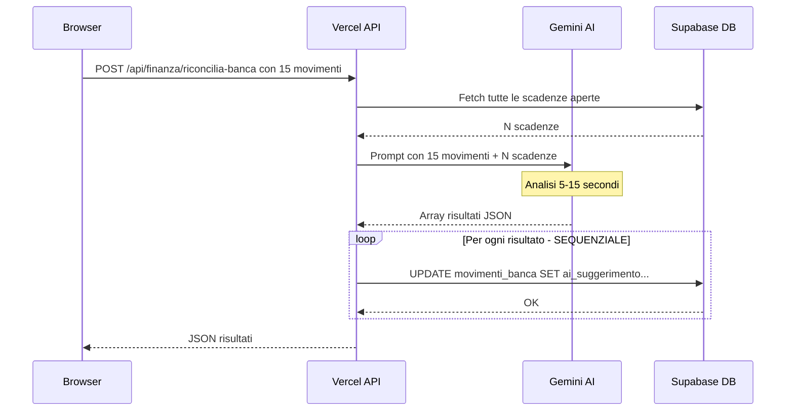
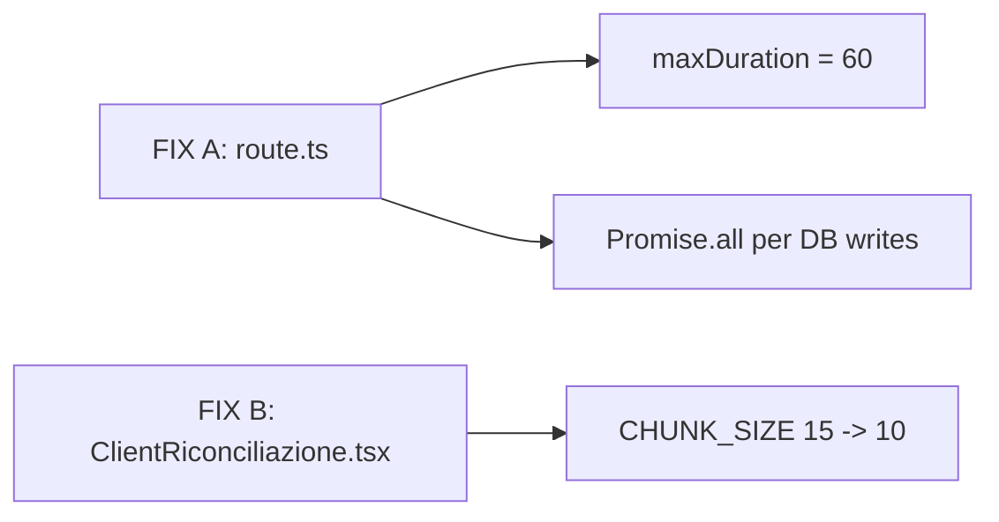

# 🚀 Fix 504 Gateway Timeout — Riconciliazione Bancaria

> Piano chirurgico per eliminare il timeout Vercel e rendere l'analisi AI fulminea.

---

## Diagnosi del Problema

Il flusso attuale della riconciliazione bancaria è:



**Collo di bottiglia identificato**: Due fattori combinati causano il 504:

1. **Timeout Vercel Free = 10s** — La route [`route.ts`](app/api/finanza/riconcilia-banca/route.ts:5) non dichiara `maxDuration`, quindi Vercel applica il default di 10 secondi per il piano Free.
2. **Salvataggio DB sequenziale** — Il ciclo `for...of` alla [riga 33](app/api/finanza/riconcilia-banca/route.ts:33) esegue ogni UPDATE uno dopo l'altro. Con 15 risultati, ogni round-trip Supabase costa ~100-200ms, totale ~1.5-3 secondi sprecati.
3. **Chunk troppo grande** — 15 movimenti in [`ClientRiconciliazione.tsx`](app/finanza/riconciliazione/ClientRiconciliazione.tsx:46) generano un prompt pesante che Gemini impiega più tempo a processare.

**Tempo totale stimato per chunk da 15**:
- DB fetch scadenze: ~200ms
- Gemini AI analysis: ~5-12s
- DB save sequenziale 15x: ~1.5-3s
- **Totale: 7-15s** → supera il limite di 10s

---

## Piano di Fix — 2 Interventi Chirurgici



### Impatto atteso dopo i fix:

| Metrica | Prima | Dopo |
|---------|-------|------|
| Timeout Vercel | 10s | **60s** |
| DB writes 15 risultati | ~2.5s sequenziale | **~200ms parallelo** |
| Chunk size | 15 movimenti | **10 movimenti** |
| Tempo Gemini per chunk | 5-12s | **3-7s** |
| **Tempo totale per chunk** | **7-15s** | **3.5-8s** |

---

## FIX A: Route API — Timeout + Parallelizzazione DB

### File: [`app/api/finanza/riconcilia-banca/route.ts`](app/api/finanza/riconcilia-banca/route.ts)

**Modifica 1** — Aggiungere `export const maxDuration = 60` prima della funzione POST. Questo dice a Vercel di concedere fino a 60 secondi a questa specifica API route. Sul piano Free il massimo effettivo è 60s, sul piano Pro è 300s.

**Modifica 2** — Sostituire il ciclo `for...of` sequenziale con `Promise.all()`. Tutti gli UPDATE partono in parallelo e Supabase li gestisce concorrentemente. Il tempo di scrittura passa da O(n) a O(1).

### Codice completo sostitutivo:

```typescript
import { NextResponse } from 'next/server';
import { createClient } from '@/utils/supabase/server';
import { matchBatchRiconciliazioneBancaria } from "@/utils/ai/gemini";

// FIX TIMEOUT: Concede fino a 60 secondi per questa API
export const maxDuration = 60; 

export async function POST(request: Request) {
  try {
    const { movimenti } = await request.json();
    
    if (!movimenti || !Array.isArray(movimenti) || movimenti.length === 0) {
      return NextResponse.json(
        { error: "Nessun movimento fornito per l'analisi." }, 
        { status: 400 }
      );
    }
    
    const supabase = await createClient();
    
    const { data: scadenzeAperte, error } = await supabase
      .from('scadenze_pagamento')
      .select('id, fattura_riferimento, importo_totale, importo_pagato, data_scadenza, tipo, soggetto_id, descrizione, anagrafica_soggetti(ragione_sociale, partita_iva, iban)')
      .neq('stato', 'pagato')
      .order('data_scadenza', { ascending: true });
      
    if (error) throw new Error(`Errore DB: ${error.message}`);
    
    if (!scadenzeAperte || scadenzeAperte.length === 0) {
      return NextResponse.json({ risultati: [] });
    }
    
    const risultatiChunk = await matchBatchRiconciliazioneBancaria(movimenti, scadenzeAperte);
    const risultatiDaSalvare = Array.isArray(risultatiChunk) ? risultatiChunk : [];
    
    // FIX TIMEOUT: Salva TUTTI i risultati IN PARALLELO
    await Promise.all(
      risultatiDaSalvare.map((res) => 
        supabase
          .from('movimenti_banca')
          .update({
            ai_suggerimento: res.scadenza_id || null,
            soggetto_id: res.soggetto_id || null,
            ai_confidence: res.confidence || 0,
            ai_motivo: res.motivo || "Nessun match trovato"
          })
          .eq('id', res.movimento_id)
      )
    );
    
    return NextResponse.json({ success: true, risultati: risultatiDaSalvare });
  } catch (error: any) {
    console.error("❌ Errore API Riconciliazione:", error);
    return NextResponse.json(
      { error: error.message || "Errore interno" }, 
      { status: 500 }
    );
  }
}
```

---

## FIX B: Frontend — Ridurre Chunk Size

### File: [`app/finanza/riconciliazione/ClientRiconciliazione.tsx`](app/finanza/riconciliazione/ClientRiconciliazione.tsx:46)

**Modifica** — Cambiare `CHUNK_SIZE` da 15 a 10 alla riga 46.

Con 10 movimenti per chunk:
- Il prompt Gemini è più leggero → risposta più rapida
- Meno risultati da salvare per batch → meno rischio timeout
- Il delay tra chunk di 3 secondi resta invariato

```typescript
// Riga 46: DA
const CHUNK_SIZE = 15;

// A
const CHUNK_SIZE = 10;
```

---

## Riepilogo Modifiche

| File | Riga | Modifica |
|------|------|----------|
| [`route.ts`](app/api/finanza/riconcilia-banca/route.ts) | 5 (nuova) | Aggiungere `export const maxDuration = 60;` |
| [`route.ts`](app/api/finanza/riconcilia-banca/route.ts:33) | 33-43 | Sostituire ciclo `for...of` con `Promise.all()` |
| [`ClientRiconciliazione.tsx`](app/finanza/riconciliazione/ClientRiconciliazione.tsx:46) | 46 | `CHUNK_SIZE = 15` → `CHUNK_SIZE = 10` |

---

## Verifica Post-Deploy

Dopo il push su Vercel:

1. Importare un CSV con almeno 20 movimenti
2. Cliccare "Avvia Matching AI"
3. Verificare che i blocchi da 10 si completino senza errori 504
4. Verificare nei log Vercel che il tempo per request sia sotto i 15 secondi
5. Confermare che i risultati AI appaiano correttamente nella tabella
