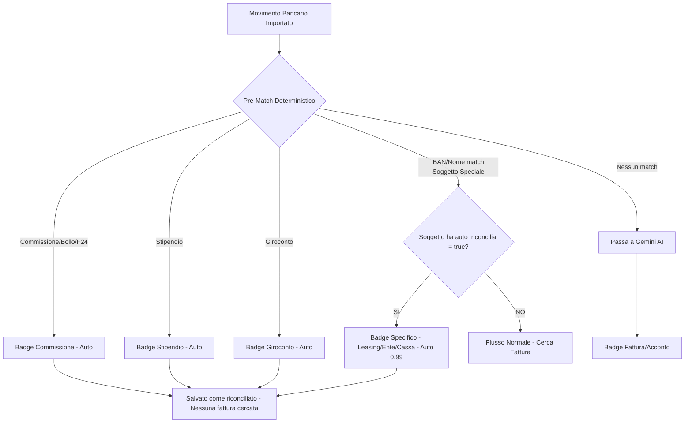
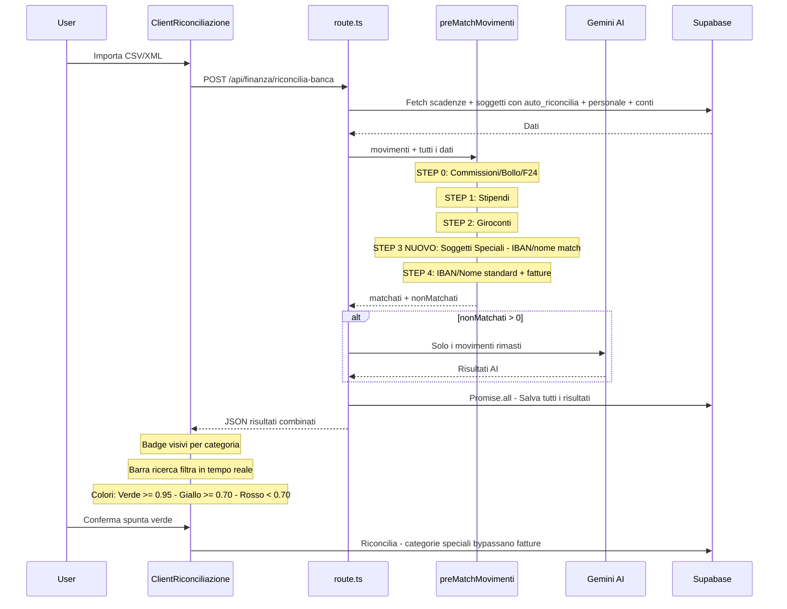

# 🏛️ Piano: Soggetti Speciali — Auto-Riconciliazione Pagamenti Periodici

> Sistema per gestire PagoPA, Leasing, Casse Edili, Cessioni del Quinto e altri pagamenti ricorrenti senza fattura elettronica SDI.

---

## Stato Attuale del Codebase

Il sistema di riconciliazione è già evoluto con:
- ✅ **Pre-match deterministico** in [`preMatchMovimenti()`](utils/data-fetcher.ts:1653) — gestisce stipendi, giroconti, commissioni bancarie
- ✅ **Categorie e badge** in [`ClientRiconciliazione.tsx`](app/finanza/riconciliazione/ClientRiconciliazione.tsx:14) — `BADGE_MAP` con fattura, stipendio, commissione, giroconto, sepa, entrata
- ✅ **Salvataggio parallelo** + `maxDuration = 60` in [`route.ts`](app/api/finanza/riconcilia-banca/route.ts:6)
- ✅ **Allocazione intelligente** in [`actions.ts`](app/finanza/riconciliazione/actions.ts:161) — subset sum + FIFO
- ✅ **Gestione categorie speciali** in [`handleConferma()`](app/finanza/riconciliazione/actions.ts:62) — commissione, giroconto, stipendio bypassano le fatture

**Cosa manca**: Un meccanismo per riconoscere automaticamente soggetti che non emettono fattura SDI — leasing auto, PagoPA, casse edili, cessioni del quinto — e riconciliarli senza intervento umano.

---

## Architettura della Soluzione



---

## STEP 1: Migrazione SQL — Colonne Soggetti Speciali

### Tabella: `anagrafica_soggetti`

Schema attuale: `id, tipo, ragione_sociale, partita_iva, codice_fiscale, indirizzo, email, telefono, pec, codice_sdi, iban, condizioni_pagamento, note, created_at`

**Aggiungiamo 2 colonne**:

```sql
-- Migrazione: Soggetti Speciali per Auto-Riconciliazione
ALTER TABLE public.anagrafica_soggetti
  ADD COLUMN IF NOT EXISTS auto_riconcilia BOOLEAN DEFAULT false,
  ADD COLUMN IF NOT EXISTS categoria_riconciliazione TEXT DEFAULT NULL;

-- COMMENTO:
-- auto_riconcilia: Se true, quando il pre-match identifica questo soggetto
--   tramite IBAN o nome, lo riconcilia automaticamente SENZA cercare fatture.
-- categoria_riconciliazione: Etichetta visiva per il badge UI.
--   Valori ammessi: 'leasing', 'ente_pubblico', 'cassa_edile', 
--   'cessione_quinto', 'utenza', 'assicurazione', NULL
--   Se NULL e auto_riconcilia=false, il soggetto segue il flusso standard fatture.

-- Indice per query veloce nel pre-match
CREATE INDEX IF NOT EXISTS idx_soggetti_auto_riconcilia 
  ON anagrafica_soggetti(auto_riconcilia) WHERE auto_riconcilia = true;
```

### Dati Iniziali — Censire i Soggetti Speciali

```sql
-- Esempio: Censire i soggetti speciali già presenti in anagrafica
-- L'utente dovrà adattare i nomi alla propria anagrafica reale

-- CA Auto Bank (Leasing Auto)
UPDATE anagrafica_soggetti 
SET auto_riconcilia = true, categoria_riconciliazione = 'leasing'
WHERE ragione_sociale ILIKE '%auto bank%' OR ragione_sociale ILIKE '%ca auto%';

-- Cofidis (Cessione del Quinto)
UPDATE anagrafica_soggetti 
SET auto_riconcilia = true, categoria_riconciliazione = 'cessione_quinto'
WHERE ragione_sociale ILIKE '%cofidis%';

-- Cassa Edile
UPDATE anagrafica_soggetti 
SET auto_riconcilia = true, categoria_riconciliazione = 'cassa_edile'
WHERE ragione_sociale ILIKE '%cassa edil%';

-- PagoPA / Enti Pubblici
UPDATE anagrafica_soggetti 
SET auto_riconcilia = true, categoria_riconciliazione = 'ente_pubblico'
WHERE ragione_sociale ILIKE '%pagopa%' 
   OR ragione_sociale ILIKE '%agenzia entrate%'
   OR ragione_sociale ILIKE '%inps%'
   OR ragione_sociale ILIKE '%inail%';
```

### File migrazione da creare

**File**: `supabase/migrations/20260224_soggetti_speciali.sql`

---

## STEP 2: Pre-Match Guardian — Soggetti Speciali

### File: [`utils/data-fetcher.ts`](utils/data-fetcher.ts:1653) — funzione `preMatchMovimenti()`

**Modifica**: Aggiungere un nuovo parametro `soggettiSpeciali` e un nuovo step nel pre-match, **DOPO** i giroconti e **PRIMA** del match IBAN/nome standard.

La funzione `preMatchMovimenti` attualmente riceve: `movimenti, scadenzeAperte, soggetti, personale, conti_banca`.

**Nuovo parametro**: Non serve! I soggetti con `auto_riconcilia = true` sono già dentro l'array `soggetti`. Basta che la query nella route li includa con i nuovi campi.

**Nuovo step da inserire** dopo il blocco giroconti (dopo riga ~1713) e prima del blocco IBAN/nome standard:

```typescript
// ==========================================
// 3. STEP SOGGETTI SPECIALI: Leasing, PagoPA, Casse Edili, etc.
// Match per IBAN o nome su soggetti con auto_riconcilia = true
// ==========================================
const soggettiSpeciali = soggetti.filter(s => s.auto_riconcilia === true);

for (const spec of soggettiSpeciali) {
  // Match per IBAN
  if (spec.iban) {
    const ibanSpec = spec.iban.replace(/\s/g, '').toUpperCase();
    const ibanInCausale = causale.replace(/\s/g, '').includes(ibanSpec);
    const ibanInXml = m.xml_iban_controparte && 
      m.xml_iban_controparte.replace(/\s/g, '').toUpperCase() === ibanSpec;
    
    if (ibanInCausale || ibanInXml) {
      matchati.push({
        movimento_id: m.id,
        scadenza_id: null,
        soggetto_id: spec.id,
        confidence: 0.99,
        motivo: `Auto-match: ${spec.ragione_sociale} via IBAN`,
        ragione_sociale: spec.ragione_sociale,
        categoria: spec.categoria_riconciliazione || 'sepa'
      });
      matched = true;
      break;
    }
  }
  
  // Match per nome (fuzzy)
  if (!matched) {
    const nomeSpec = normalizzaNome(spec.ragione_sociale || '');
    const paroleNome = nomeSpec.split(' ').filter(w => w.length > 2);
    if (paroleNome.length > 0 && paroleNome.every(p => causaleNorm.includes(p))) {
      matchati.push({
        movimento_id: m.id,
        scadenza_id: null,
        soggetto_id: spec.id,
        confidence: 0.99,
        motivo: `Auto-match: ${spec.ragione_sociale} via nome in causale`,
        ragione_sociale: spec.ragione_sociale,
        categoria: spec.categoria_riconciliazione || 'sepa'
      });
      matched = true;
      break;
    }
  }
}

if (matched) continue;
```

**Logica**: Se un movimento contiene l'IBAN o il nome di un soggetto speciale, viene immediatamente riconciliato con confidence 0.99, **senza mai passare da Gemini AI**. Zero token consumati.

---

## STEP 3: Route API — Includere i Nuovi Campi

### File: [`app/api/finanza/riconcilia-banca/route.ts`](app/api/finanza/riconcilia-banca/route.ts:28)

**Modifica**: La query soggetti alla riga 28-30 deve includere i nuovi campi:

```typescript
// PRIMA (riga 28-30):
const { data: soggetti, error: errorSoggetti } = await supabase
  .from('anagrafica_soggetti')
  .select('id, ragione_sociale, partita_iva, iban');

// DOPO:
const { data: soggetti, error: errorSoggetti } = await supabase
  .from('anagrafica_soggetti')
  .select('id, ragione_sociale, partita_iva, iban, auto_riconcilia, categoria_riconciliazione');
```

Nessun'altra modifica alla route — il `preMatchMovimenti` gestisce tutto internamente.

---

## STEP 4: Actions — Gestire Nuove Categorie

### File: [`app/finanza/riconciliazione/actions.ts`](app/finanza/riconciliazione/actions.ts:62)

**Modifica**: Estendere la lista delle categorie speciali nel `handleConferma`:

```typescript
// PRIMA (riga 62):
if (['commissione', 'giroconto', 'stipendio'].includes(categoria)) {

// DOPO:
if (['commissione', 'giroconto', 'stipendio', 'leasing', 'ente_pubblico', 'cassa_edile', 'cessione_quinto', 'utenza', 'assicurazione'].includes(categoria)) {
```

Questo garantisce che quando l'utente clicca la spunta verde su un soggetto speciale, il movimento viene archiviato come riconciliato senza toccare la tabella `scadenze_pagamento`.

---

## STEP 5: UI Badges — Nuovi Tipi Visivi

### File: [`app/finanza/riconciliazione/ClientRiconciliazione.tsx`](app/finanza/riconciliazione/ClientRiconciliazione.tsx:14)

**Modifica**: Estendere il `BADGE_MAP` con le nuove categorie:

```typescript
const BADGE_MAP: Record<string, { icon: string; label: string; className: string }> = {
  fattura:           { icon: '📄', label: 'Fattura',          className: 'bg-blue-100 text-blue-800' },
  stipendio:         { icon: '💼', label: 'Stipendio',        className: 'bg-purple-100 text-purple-800' },
  commissione:       { icon: '🏦', label: 'Comm. Banca',      className: 'bg-zinc-100 text-zinc-700' },
  giroconto:         { icon: '🔄', label: 'Giroconto',        className: 'bg-cyan-100 text-cyan-800' },
  sepa:              { icon: '⚡', label: 'SEPA/SDD',         className: 'bg-orange-100 text-orange-800' },
  entrata:           { icon: '💰', label: 'Entrata',          className: 'bg-emerald-100 text-emerald-800' },
  // NUOVI — Soggetti Speciali
  leasing:           { icon: '🚗', label: 'Leasing',          className: 'bg-amber-100 text-amber-800' },
  ente_pubblico:     { icon: '🏛️', label: 'Ente/PagoPA',     className: 'bg-red-100 text-red-800' },
  cassa_edile:       { icon: '🏗️', label: 'Cassa Edile',     className: 'bg-yellow-100 text-yellow-800' },
  cessione_quinto:   { icon: '💳', label: 'Cessione Quinto',  className: 'bg-pink-100 text-pink-800' },
  utenza:            { icon: '💡', label: 'Utenza',           className: 'bg-teal-100 text-teal-800' },
  assicurazione:     { icon: '🛡️', label: 'Assicurazione',   className: 'bg-indigo-100 text-indigo-800' },
};
```

**Modifica aggiuntiva**: Estendere la condizione per mostrare il pulsante conferma/rifiuta (riga 243):

```typescript
// PRIMA:
{(m.ai_suggerimento || isAcconto || ['stipendio', 'commissione', 'giroconto', 'sepa'].includes(m.categoria_dedotta)) ? (

// DOPO — Usa il BADGE_MAP come source of truth:
{(m.ai_suggerimento || isAcconto || (m.categoria_dedotta && m.categoria_dedotta !== 'fattura')) ? (
```

Questo è più robusto: qualsiasi categoria nel `BADGE_MAP` che non sia `fattura` mostra automaticamente i pulsanti conferma/rifiuta.

---

## STEP 6: Barra di Ricerca e Filtri

### File: [`app/finanza/riconciliazione/ClientRiconciliazione.tsx`](app/finanza/riconciliazione/ClientRiconciliazione.tsx:146)

**Aggiungere** uno stato React `searchTerm` e un `<Input>` di ricerca sopra la tabella:

```typescript
// Nuovo stato (dopo riga 30):
const [searchTerm, setSearchTerm] = useState('');

// Computed: movimenti filtrati
const movimentiFiltrati = movimentiLocali.filter(m => {
  if (!searchTerm.trim()) return true;
  const term = searchTerm.toLowerCase();
  return (
    (m.descrizione || '').toLowerCase().includes(term) ||
    (m.ragione_sociale || '').toLowerCase().includes(term) ||
    (m.ai_motivo || '').toLowerCase().includes(term) ||
    (m.categoria_dedotta || '').toLowerCase().includes(term) ||
    String(m.importo).includes(term) ||
    new Date(m.data_operazione).toLocaleDateString('it-IT').includes(term)
  );
});
```

**UI**: Inserire tra le due Card e la tabella:

```tsx
{/* Barra di Ricerca */}
<div className="flex items-center gap-3">
  <div className="relative flex-1">
    <Search className="absolute left-3 top-1/2 -translate-y-1/2 h-4 w-4 text-zinc-400" />
    <Input 
      placeholder="Cerca per causale, soggetto, importo, data..." 
      value={searchTerm}
      onChange={(e) => setSearchTerm(e.target.value)}
      className="pl-10"
    />
  </div>
  <Badge variant="outline" className="whitespace-nowrap">
    {movimentiFiltrati.length} / {movimentiLocali.length} movimenti
  </Badge>
</div>
```

**Modifica**: Nella tabella, sostituire `movimentiLocali.map(...)` con `movimentiFiltrati.map(...)`.

---

## STEP 7: Anagrafica UI — Toggle Auto-Riconciliazione

### File: [`app/anagrafiche/[id]/page.tsx`](app/anagrafiche/[id]/page.tsx)

**Aggiungere** nella sezione dettaglio soggetto:

1. Un toggle/checkbox per `auto_riconcilia`
2. Un select per `categoria_riconciliazione` — visibile solo se il toggle è attivo
3. Una server action per salvare le modifiche

```tsx
{/* Sezione Regole Riconciliazione */}
<Card>
  <CardHeader>
    <CardTitle className="text-sm">Regole Riconciliazione Automatica</CardTitle>
  </CardHeader>
  <CardContent className="space-y-3">
    <div className="flex items-center gap-3">
      <input 
        type="checkbox" 
        checked={soggetto.auto_riconcilia} 
        onChange={...} 
      />
      <label>Auto-riconcilia senza fattura</label>
    </div>
    {soggetto.auto_riconcilia && (
      <select value={soggetto.categoria_riconciliazione}>
        <option value="leasing">🚗 Leasing</option>
        <option value="ente_pubblico">🏛️ Ente Pubblico / PagoPA</option>
        <option value="cassa_edile">🏗️ Cassa Edile</option>
        <option value="cessione_quinto">💳 Cessione del Quinto</option>
        <option value="utenza">💡 Utenza</option>
        <option value="assicurazione">🛡️ Assicurazione</option>
      </select>
    )}
  </CardContent>
</Card>
```

---

## STEP 8: Sistema Colori Confidence

### File: [`app/finanza/riconciliazione/ClientRiconciliazione.tsx`](app/finanza/riconciliazione/ClientRiconciliazione.tsx:229)

Il sistema colori attuale è parziale. Standardizziamo:

| Confidence | Colore | Significato |
|-----------|--------|-------------|
| >= 0.95 | 🟢 Verde `bg-emerald-100` | Match esatto fattura O Soggetto Speciale auto |
| 0.70 - 0.94 | 🟡 Giallo `bg-amber-100` | Soggetto identificato, fattura incerta |
| < 0.70 | 🔴 Rosso `bg-rose-100` | Allarme: soggetto sconosciuto |

```typescript
// Helper function per il colore confidence
const getConfidenceStyle = (conf: number) => {
  if (conf >= 0.95) return 'bg-emerald-100 text-emerald-800';
  if (conf >= 0.70) return 'bg-amber-100 text-amber-800';
  return 'bg-rose-100 text-rose-800';
};
```

---

## Riepilogo File da Modificare

| # | File | Tipo Modifica | Descrizione |
|---|------|--------------|-------------|
| 1 | `supabase/migrations/20260224_soggetti_speciali.sql` | **NUOVO** | ALTER TABLE + indice + dati iniziali |
| 2 | [`utils/data-fetcher.ts`](utils/data-fetcher.ts:1653) | Modifica | Nuovo step Soggetti Speciali in `preMatchMovimenti()` |
| 3 | [`app/api/finanza/riconcilia-banca/route.ts`](app/api/finanza/riconcilia-banca/route.ts:28) | Modifica | Aggiungere `auto_riconcilia, categoria_riconciliazione` alla query soggetti |
| 4 | [`app/finanza/riconciliazione/actions.ts`](app/finanza/riconciliazione/actions.ts:62) | Modifica | Estendere lista categorie speciali in `handleConferma` |
| 5 | [`app/finanza/riconciliazione/ClientRiconciliazione.tsx`](app/finanza/riconciliazione/ClientRiconciliazione.tsx) | Modifica | Badge nuovi + search bar + filtro + colori confidence |
| 6 | [`app/anagrafiche/[id]/page.tsx`](app/anagrafiche/[id]/page.tsx) | Modifica | Toggle auto_riconcilia + select categoria |
| 7 | [`app/anagrafiche/actions.ts`](app/anagrafiche/actions.ts) | Modifica | Server action per salvare regole riconciliazione |

---

## Flusso Completo Post-Implementazione



---

## Vantaggi

1. **Zero token AI** per soggetti speciali — il pre-match deterministico li cattura prima di Gemini
2. **Zero fatture fantasma** — i pagamenti periodici non cercano fatture SDI inesistenti
3. **Configurabile dall'utente** — il toggle in anagrafica permette di aggiungere nuovi soggetti speciali senza toccare il codice
4. **Ricerca istantanea** — la barra di ricerca filtra client-side, zero chiamate API
5. **Colori chiari** — verde/giallo/rosso comunicano immediatamente lo stato di ogni movimento
