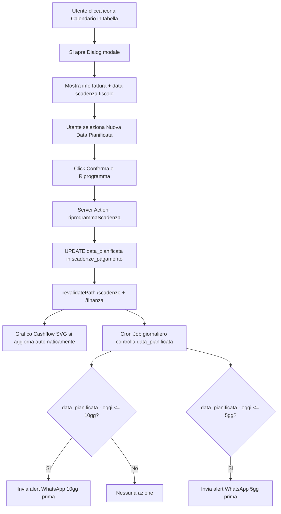

# Plan 09: Fix Calendario Schedulatore + Rate Mancanti (Pedretti)

## Analisi Completata

Ho analizzato tutti i file coinvolti e confermo i due problemi e la strategia di fix.

---

## PROBLEMA 1: Il bottone Calendario scarica un file .ics inutile

### Root Cause
- [`CalendarLinkButton.tsx`](app/finanza/components/CalendarLinkButton.tsx:6) è un semplice link `<a href="/api/calendar?scadenzaId=...">` che apre [`route.ts`](app/api/calendar/route.ts:1) e scarica un file `.ics`
- Il workflow corretto richiesto è: **click → modale con date picker → aggiorna `data_pianificata` → ricalcola cashflow → predisponi alert WhatsApp**
- [`ScadenzeTable.tsx`](app/scadenze/components/ScadenzeTable.tsx:116) passa solo `scadenzaId` al componente, ma il nuovo modale ha bisogno dell'intero oggetto `scadenza`

### Impatto sui file

| File | Azione |
|------|--------|
| [`app/scadenze/actions.ts`](app/scadenze/actions.ts) | Aggiungere `riprogrammaScadenza()` server action |
| [`app/finanza/components/CalendarLinkButton.tsx`](app/finanza/components/CalendarLinkButton.tsx) | Riscrivere completamente: da link .ics a Dialog modale |
| [`app/scadenze/components/ScadenzeTable.tsx`](app/scadenze/components/ScadenzeTable.tsx:116) | Cambiare prop da `scadenzaId={s.id}` a `scadenza={s}` |
| [`types/finanza.ts`](types/finanza.ts:4) | Aggiungere `data_pianificata?: string` a `ScadenzaPagamento` |
| [`app/api/cron/scadenze/route.ts`](app/api/cron/scadenze/route.ts:100) | Aggiungere PARTE 5: alert WhatsApp 10gg e 5gg prima di `data_pianificata` |
| [`app/api/calendar/route.ts`](app/api/calendar/route.ts) | Deprecare/rimuovere (non più necessario) |

### Workflow Nuovo (Mermaid)



### Dettaglio Implementazione

#### STEP 1.1: Server Action `riprogrammaScadenza`
Aggiungere in fondo a [`app/scadenze/actions.ts`](app/scadenze/actions.ts:277):
```typescript
export async function riprogrammaScadenza(scadenzaId: string, nuovaData: string) {
  const supabase = await createClient();
  const { error } = await supabase
    .from('scadenze_pagamento')
    .update({ data_pianificata: nuovaData })
    .eq('id', scadenzaId);
  if (error) throw new Error("Errore durante la riprogrammazione");
  revalidatePath('/scadenze');
  revalidatePath('/finanza');
  revalidatePath('/finanza/programmazione');
  return { success: true };
}
```

#### STEP 1.2: Nuovo `CalendarLinkButton.tsx`
Riscrivere completamente il file. Il nuovo componente:
- Accetta `scadenza: any` come prop (non più solo `scadenzaId`)
- Apre un `Dialog` con info fattura, data scadenza fiscale, e un `<input type="date">`
- Al submit chiama `riprogrammaScadenza(scadenza.id, nuovaData)`
- Mostra feedback di successo e chiude il modale

#### STEP 1.3: Aggiornare `ScadenzeTable.tsx`
Cambiare la riga 116:
- DA: `<CalendarLinkButton scadenzaId={s.id} />`
- A: `<CalendarLinkButton scadenza={s} />`

#### STEP 1.4: Aggiornare `types/finanza.ts`
Aggiungere `data_pianificata?: string;` all'interfaccia `ScadenzaPagamento`

#### STEP 1.5: Cron Job WhatsApp Alert
Aggiungere una PARTE 5 in [`app/api/cron/scadenze/route.ts`](app/api/cron/scadenze/route.ts) che:
- Query scadenze con `data_pianificata` nei prossimi 10 giorni
- Filtra quelle a esattamente 10gg e 5gg
- Invia messaggio WhatsApp all'admin con dettagli fattura

---

## PROBLEMA 2: Fatture a rate mancanti (Caso Pedretti)

### Root Cause
Il file [`riconciliazione_xml.py`](scripts/riconciliazione_xml.py:122) genera UNA SOLA scadenza per fattura usando `calcola_data_scadenza()` che calcola una data basata sulle condizioni di pagamento dell'anagrafica. **Non legge affatto i blocchi `<DettaglioPagamento>` dall'XML**, quindi ignora completamente le rate esplicite.

Similmente, [`fatture_vendita_xml.py`](scripts/fatture_vendita_xml.py:152) usa `root.find('.//DettaglioPagamento')` (singolare) che restituisce solo la prima rata.

### Impatto sui file

| File | Azione |
|------|--------|
| [`scripts/riconciliazione_xml.py`](scripts/riconciliazione_xml.py:121) | Riscrivere sezione scadenza: leggere TUTTI i `DettaglioPagamento` dall'XML |
| [`scripts/fatture_vendita_xml.py`](scripts/fatture_vendita_xml.py:151) | Riscrivere sezione scadenza: usare `findall` invece di `find` |
| Supabase SQL Editor | Eseguire INSERT manuale per la rata mancante di Pedretti |

### Fix per `riconciliazione_xml.py` (linee 121-134)

Sostituire la logica attuale che usa `calcola_data_scadenza()` con:
```python
# --- AUTO-GENERAZIONE SCADENZE (SUPPORTO MULTI-RATA) ---
rate_xml = body.findall(".//DettaglioPagamento")

if rate_xml:
    # L'XML contiene rate esplicite: creiamo una scadenza per ogni rata
    for i, rata in enumerate(rate_xml):
        importo_rata = float(rata.findtext('ImportoPagamento', '0'))
        data_scad_rata = rata.findtext('DataScadenzaPagamento')
        if not data_scad_rata:
            data_scad_rata = calcola_data_scadenza(data_fattura, condizioni_pag)
        
        supabase.table("scadenze_pagamento").insert({
            "tipo": "uscita",
            "soggetto_id": soggetto_id,
            "fattura_riferimento": numero_fattura,
            "importo_totale": importo_rata,
            "importo_pagato": 0,
            "data_emissione": data_fattura,
            "data_scadenza": data_scad_rata,
            "data_pianificata": data_scad_rata,
            "stato": "da_pagare",
            "descrizione": f"Fattura n. {numero_fattura} da {ragione_sociale} (Rata {i+1}/{len(rate_xml)})"
        }).execute()
        print(f"   📅 Rata {i+1}/{len(rate_xml)}: €{importo_rata} scade {data_scad_rata}")
else:
    # Nessuna rata nell'XML: fallback al calcolo basato su condizioni
    data_scad = calcola_data_scadenza(data_fattura, condizioni_pag)
    supabase.table("scadenze_pagamento").insert({
        "tipo": "uscita",
        "soggetto_id": soggetto_id,
        "fattura_riferimento": numero_fattura,
        "importo_totale": importo_totale,
        "importo_pagato": 0,
        "data_emissione": data_fattura,
        "data_scadenza": data_scad,
        "data_pianificata": data_scad,
        "stato": "da_pagare",
        "descrizione": f"Fattura n. {numero_fattura} da {ragione_sociale}"
    }).execute()
    print(f"   📅 Scadenziario: Scadenza {data_scad} generata.")
```

### Fix per `fatture_vendita_xml.py` (linee 151-179)

Stessa logica: sostituire `root.find('.//DettaglioPagamento')` con `root.findall('.//DettaglioPagamento')` e creare una scadenza per ogni rata trovata.

### SQL Fix Immediato per Pedretti

Da eseguire nell'SQL Editor di Supabase:
```sql
-- Inserisci la rata mancante del 10/04/2025
INSERT INTO scadenze_pagamento (
  tipo, soggetto_id, fattura_riferimento, importo_totale, importo_pagato,
  data_emissione, data_scadenza, data_pianificata, stato
)
SELECT 'uscita', soggetto_id, 'FVI2500079', 53090.00, 0,
  '2025-01-27', '2025-04-10', '2025-04-10', 'da_pagare'
FROM scadenze_pagamento
WHERE fattura_riferimento = 'FVI2500079'
LIMIT 1;

-- Correggi importo prima rata se era il totale intero
UPDATE scadenze_pagamento
SET importo_totale = 53090.00
WHERE fattura_riferimento = 'FVI2500079' AND data_scadenza = '2025-03-10';
```

---

## Riepilogo Ordine di Esecuzione

1. **Type update** → `types/finanza.ts` (aggiungere `data_pianificata`)
2. **Server action** → `app/scadenze/actions.ts` (aggiungere `riprogrammaScadenza`)
3. **UI Component** → `app/finanza/components/CalendarLinkButton.tsx` (riscrivere)
4. **Table integration** → `app/scadenze/components/ScadenzeTable.tsx` (passare oggetto intero)
5. **Cron WhatsApp** → `app/api/cron/scadenze/route.ts` (aggiungere PARTE 5)
6. **Python fix** → `scripts/riconciliazione_xml.py` (multi-rata)
7. **Python fix** → `scripts/fatture_vendita_xml.py` (multi-rata)
8. **SQL manuale** → Pedretti fix in Supabase
9. **Cleanup** → Deprecare `app/api/calendar/route.ts`
